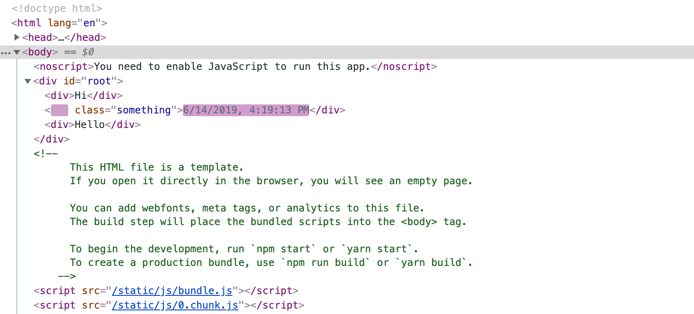

# React

**A JavaScript library for building user interfaces.**

More than 5 years have passed since the official React´s release (*Facebook - March 2013*); nevertheless, the community interest and adoption are in constant growth.

---

The following *information* is only illustrative. 

*Metric 1:* `github` stars - 06/02/2019

* **[140_271]** [vuejs/vue](https://github.com/vuejs/vue)
* **[130_395]** [facebook/react](https://github.com/facebook/react)
* **[59_562]** [angular/angular.js](https://github.com/angular/angular.js)
* **[51_687]** [jquery/jquery](https://github.com/jquery/jquery)
* **[48_767]** [angular/angular](https://github.com/angular/angular)

*Metric 2:* `dependent repositories` - 06/02/2019

* **[2_037_095]** [facebook/react](https://github.com/facebook/react)
* **[862_083]** [vuejs/vue](https://github.com/vuejs/vue)
* **[330_978]** [jquery/jquery](https://github.com/jquery/jquery)

---

Every time I talked with `young DEVs` (youth here's not more than a short term of exposure or lack "production experience"), the React´s stamp seems to widely extend its real existence... For the new rows of builders, handling `UIs` without a solid `library` (like React) or `framework` (Angular or Vue.js) is something unthinkable and, perhaps, fumes of an old-past ready to be forgotten.

No matter the appliance you pick to support your work (here´s an elder AngularJS´s patron) we all want the same:

* Simplicity (Abstraction)
* Scalability
* Performance
* Security
* Friendly debugging tools

(I would also include *Community*, which -undoubtedly- made `React` what it's today. In a `View library` where everything has to be added: `routing`, `validation`, `global state`, etc, plurality is a must that comes from the hand of popular adoption: *the bigger the Community, the more versatile the ecosystem will be*)

## Why React...?

* *Composition:* small pieces of code (components) that allow us to build complex UIs as if we were playing with *LEGOs*
* Use of *objects* to build the Views.
* *Declarative approach:* we "define" what we want not "how" (steps) to obtain what we want (imperative)
* *Unidirectional data flow* (from parent to child component)
* *JavaScript logic*: we use just *JS* (not a particular "template language")
* *Server Side Integration* (SSR as first render)
* *Selective re-render* (Virtual DOM)
* Easy *Mobile Apps Development* with `React Native`

---

### *SPA:* Single Page Applications

The idea behind `SPA` is having a single `HTML document` using `JS` to change what the user sees on the screen, avoiding -in consequence- having to refresh the page.

*Example:* if a user clicks on x-link (which is going to be prevented of its default behavior and it will act as a "toggler"), x-data (all the needed assets were downloaded on the *first load*: `HTML/CSS/JS`) is going to be requested `asynchronously` showing the proper view for that particular "model".

`React` does not require a SPA implementation or approach. You can mix React with other JS libraries, use it partially (for certain features) and combine it with `Server Side Logic`. Most of the examples I'll provide are `SPAs` given that are focus is on the features, not the application. 

Later, we are going to address `routing` and how to keep *UI and URL in sync* with `react-router` package. I strongly encourage you to read **React Router** [documentation](https://github.com/ReactTraining/react-router).

---

### What´s JSX...?

It´s an extension to `JS syntax` recommended by React to describe *how our UI should look like*. It´s not mandatory; just a really convenient,standardized and abstract way of writing our components.

*Note:* It´s important to remember React´s motto: `A JavaScript library for building user interfaces.` Following this premise, you will find coherent to have a strict relation between `logic` and `markup` in the same small unit or component, r, as `React docs` describe...

> "React embraces the fact that rendering logic is inherently coupled with other UI logic: how events are handled, how the state changes over time, and how the data is prepared for display".


Here´s and example of a class-based component using `JSX`

```javascript
class SayHi extends React.Component {
  render() {
    return <div>Hi {this.props.name}</div>;
  }
}

ReactDOM.render(<SayHi hisName="Peter" />, document.getElementById('root'));
```

... and the same example (*transpiled* with `Babel`) with `plain JavaScript syntax`

```javascript
class SayHi extends React.Component {
  render() {
    return React.createElement('div', null, 'Hi ', this.props.name);
  }
}

ReactDOM.render(
  React.createElement(SayHi, { hisName: 'Peter' }),
  document.getElementById('root')
);
```

*Note:* `Babel` is used to transpile `es2015 or ES6` code into syntax that old browsers can interpret.


Before leaving the `JSX` introductory annex, I should advice you we are going to follow [Airbnb React/JSX Style Guide](https://github.com/airbnb/javascript/tree/master/react)

---

### React and DOM operations: **re-rendering** and the **Virtual DOM**

We are going to see this closely in future lessons, however, one of the *key* features of `React` (and what you should definitely take at the moment) is its efficiency.

`React` keeps track of previous stages or *how the UI looked before*. The `Virtual DOM` is a tree composed of nodes. Each element is represented by one of these nodes. When something changes, a new `Virtual DOM` is generated and compared with the "snapshot" of the previous stage through the "diffing algorithm" performing, as the result, the minimal operations in the real `DOM`.

In the following SC you can easily see HOW `React` is just updating the "textContent" of the div element without even affecting the class attribute of that node. That's efficiency! 



Code:
```javascript
import React, { Component } from 'react';

const displayTime = () => {
  return new Date().toLocaleString()
}

class App extends Component {

  state = {
    time: 'Initializing timer...'
  }

  componentDidMount() {
    this.interval = setInterval(
      () => this.setState({ time: displayTime() }), 1000
    )
  }

  componentWillUnmount() {
    clearInterval(this.interval)
  }

  render() {
    return (
      <React.Fragment>
        <div>Hi</div>
        <div className="something">{this.state.time}</div>
        <div>Hello</div>
      </React.Fragment>
    )
  }
}


export default App;
```