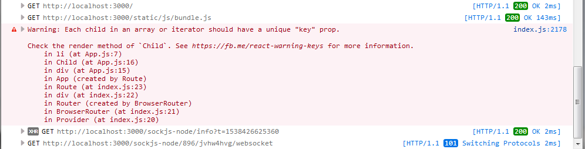
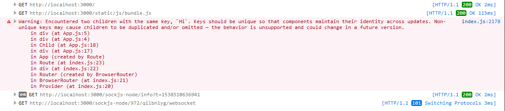

#### Passing props

**src/App.js** - Class Component

```javascript
import React, { Component } from 'react';
import Child from './Child';

class App extends Component {
  render() {
    return (
      <div className="App">
        <Child onShowingHello="Hello" />
      </div>
    );
  }
}

export default App;
```

**src/Child.js** - Functional Component

```javascript
import React from 'react';

const Child = props => (
  <div>
    <div>I´m receiving... {props.onShowingHello}</div>
  </div>
);

export default Child;
```

If you go to http://localhost:3000/ you will see: `I´m receiving... Hello`

Passing an array and `Each child in an array or iterator should have a unique "key" prop.` warning.
Imagine that rather than passing a `string` we pass an `array` and we loop it with `.map()` on our `child component`
Probably, you would do something like...
**src/App.js**

```javascript
import React, { Component } from 'react';

const Child = props => (
  <div>
    <div>
      I´m receiving...{' '}
      {props.onShowingHello.map(eachGreeting => <li>{eachGreeting}</li>)}
    </div>
  </div>
);

class App extends Component {
  render() {
    return (
      <div className="App">
        <Child onShowingHello={['Hi', 'Hello', 'Hola', 'Hi']} />
      </div>
    );
  }
}

export default App;
```

... and it works, however, if you check your `dev console` you will see the following warning...



What´s going on...?
When we are looping an array, each child (no matter the element) must have a **UNIQUE key** property which will allow React to preserve the Component>DOM relation used in the reconciliation process, letting React know which element changed. Having a key is a stable way of referring to x-element (see it ad your Passport ID).

**We can "fix" this adding a key to the element**. For our example, we are going to use the `item index` since we don´t have other "stable value" (I don´t recommend using it in a real project).

If we try to use the own element/item, like "Hi", and, if our array has the element twice: `['Hi', 'Hello', 'Hola', 'Hi']` we will end with a similar warning but now referring to "key duplication".



However, you should remember that index is -still- potentially dangerous and it can produce "unexpected side effects".

Note: We use `htmlFor` instead of `for`.

<!-- TODO: Extend this... -->

```javascript
import React, { Component } from 'react';

const Child = props => (
  <div>
    <div>
      I´m receiving...{' '}
      {props.onShowingHello.map((eachGreeting, index) => (
        <li key={index}>
          <input
            type="checkbox"
            id={eachGreeting}
            name={eachGreeting}
            value={eachGreeting}
          />
          <label htmlFor={eachGreeting}>{eachGreeting}</label>
        </li>
      ))}
    </div>
  </div>
);

class App extends Component {
  state = {
    ourSalutation: ['Hi', 'Hello', 'Hola']
  };
  render() {
    return (
      <div className="App">
        <Child onShowingHello={this.state.ourSalutation} />
        <button
          onClick={() =>
            this.setState({
              ourSalutation: ['be', ...this.state.ourSalutation]
            })
          }>
          Add
        </button>
      </div>
    );
  }
}

export default App;
```

If we run our App we will see a plain (extremely flat) list of checkboxes with no errors or warnings in our `dev console`. Next to each checkbox, the proper element with its index.

Do the following...

1. Check "Hola" (the last element) **which has index 2**
2. Click on Add
3. Revise the list
   Yes... Now "Hello" is checked. It changed its index from 1 to 2 and "Hola" is on index 3.

Does it make sense now...?
React still thinks that the key attribute with value 2 is "tied" to "Hola".

How should we fix the issue in a PROD env...?

First, in our case, change the hard-coded value of the local state property `ourSalutation`

Before:

```javascript
state = {
  ourSalutation: ['Hi', 'Hello', 'Hola']
};
```

After:

```javascript
state = {
  ourSalutation: [
    { salutation: 'Hi', timestamp: '29519bf2-c68e-11e8-8f1c-f3e5f253a17f' },
    {
      salutation: 'Hello',
      timestamp: '3c72eae1-c68e-11e8-a508-89da3bf216bc'
    },
    { salutation: 'Hola', timestamp: '46af7641-c68e-11e8-9146-8343393a23eb' }
  ]
};
```

Second, install the package `uuid` and use the `version 1` (aka, timestamp). Then, change you `onClick handler`

Before:

```javascript
<button
onClick={() =>
  this.setState({
    ourSalutation: ['be', ...this.state.ourSalutation]
  })
}>
```

After:

```javascript
<button
  onClick={() =>
    this.setState({
      ourSalutation: [
        { salutation: 'be', timestamp: uuid.v1() },
        ...this.state.ourSalutation
      ]
    })
  }
>
```

Third, in your `Child component` destructure the object and use `timestamp` as value for the `key`.
Now, try again checking x-checkbox and clicking on Add.

I´m attaching the entire example with all the needed code in the folder: `examples/basic-react-example[map-with-key]`

_Remember_: each key should be `unique` and `static` in the `context` of x-array. This means that if we have 2 different arrays that we are mapping, we can have same key values since these "IDs" are referring to elements of different array (just a shared addresses but on different States).

Let´s say that we want to pass down a state property of App.js to Child.js as props.

**src/App.js**

```javascript
import React, { Component } from 'react';
import Child from './Child';

class App extends Component {
  state = {
    message: 'Hello'
  };
  render() {
    return (
      <div className="App">
        <Child onShowingHello={this.state.message} />
      </div>
    );
  }
}

export default App;
```

**src/Child.js**
If we are using a Functional Component we will access to props through `props`, for example, `props.onPassingMessage`

If we are using a Class Component, thorugh `this.props.onPassingMessage`

##### Dynamic values passed as props and rendering

In the previous examples we were hard-coding the value of message...

```javascript
state = {
  message: 'Hello'
};
```

However, in practice, usually our data is going to be dynamic. Think in an input where the user introduce some value (for example message) which is going to be passed down as prop. We would start with an empty string (`message: ''`), then a Controlled Form would update the value of the state property (`message: 'Hola'`) what would result in... `I´m receiving... Hola`
But, until your parent Component pass "something" down, different than the default empty string, the Child one will render: `I´m receiving...`
Not a great user experience... I´m rendering... Nothing...?

We can fix this replacing...

```html
...
<div>I´m receiving... {props.onShowingHello}</div>
...
```

With this...

```javascript
...
{onShowingHello !== '' ? `I´m receiving... ${onShowingHello}` : null}
...
```

Now, we are only going to display our message if it´s different than the default one (empty string).

## Going from the data to the UI

One of the most common cases is...

1. You have a RESTful API retrieving JSON. Example: https://jsonplaceholder.typicode.com/users You can check APIs documentation: https://github.com/typicode/jsonplaceholder#how-to

2. You defined (or at least know) the data set. Example: An array of objects (https://jsonplaceholder.typicode.com/users)

3. You know where are you going to hold the data. Example: `local state`.

4. You know how are you going to display or show the data (and local state related views if they are needed). Example: We are going to show all the users including (in our render) just `username` and `email`.

5. You know related functionality. Example: We are going to sort by id DESC (you also know if you are going to use third-party functionality; in this case, `sort-by` package); so from 10 to 1.

Example:

First, remember to install `sort-by` - `npm i sort-by`

```javascript
import React, { Component } from 'react';
import sortBy from 'sort-by';

const api = 'https://jsonplaceholder.typicode.com';

class App extends Component {
  state = {
    users: []
  };

  componentDidMount() {
    fetch(`${api}/users`)
      .then(res => res.json())
      .then(users => {
        this.setState({ users });
      });
  }

  renderUsers = () => {
    return this.state.users.sort(sortBy('-id')).map(user => {
      return (
        <li key={user.id}>{`Username: ${user.username}
        Email: ${user.email}`}</li>
      );
    });
  };

  render() {
    return <ul>{this.renderUsers()}</ul>;
  }
}

export default App;
```

At the moment, we have just one big and tied Component. However, we could split this Component into Sub-Components **where each one cares just about one thing**.
We could decompose our previous example in something like (avoid being extremely granular)

1. `App`: the whole - Purpose: renders our main component (UserList).

* `UserList` - Purpose: implements the logic to request and handle the API response (which includes rendering our User Component).
  * `User` - Purpose: JSX to show on screen.

```javascript
import React, { Component } from 'react';
import sortBy from 'sort-by';

const api = 'https://jsonplaceholder.typicode.com';

let User = ({ id, email }) => {
  return <div>{email}</div>;
};

class UserList extends Component {
  state = {
    users: []
  };

  componentDidMount() {
    fetch(`${api}/users`)
      .then(res => res.json())
      .then(users => {
        this.setState({ users });
      });
  }

  renderUsers = () => {
    return this.state.users.map(user => {
      return <User email={user.email} key={user.id} />;
    });
  };
  render() {
    return <div>{this.renderUsers()}</div>;
  }
}

class App extends Component {
  render() {
    return (
      <div>
        <UserList />
      </div>
    );
  }
}

export default App;
```

Of course, you can move each component to a new file and make the proper `imports` to allow re-usability.

#### Props and document.title

If you go to your public (or dist) folder, the one where you have the boilerplate `index.html`, you will see that CRA set a "static title" for your App: `<title>React App</title>`. With one screen (in this case the root one) you could replace and set the title there without bigger issues; however, as you application starts to scale (or grow) a pre-harcoded title will not always satisfy your needs.
Later, we will try a more complex way of dealing with `HTML header´s tags`, but for the moment, we can add some code to our `componentDidMount()` lifecycle method utilizing as well, the `componentDidUpdate()`.

We have a list of users where we are rendering just emails; so, we can set a title like: `E-mail list: x results` where x is a dynamic number.

One more thing... Even when we did not see (yet) the Local State lesson, we are going to double the bet and not only use the setState() async method if not, also, take advantage of its second parameter or argument: a `callback` or a function to execute once the state property is updated.

```javascript
componentDidMount() {
  fetch(`${api}/users`)
    .then(res => res.json())
    .then(users => {
      this.setState({ users }, () => {
        document.title = `E-mail list: ${this.state.users.length} results`;
      });
    });
}
```

Open you Web Developer Console, inspect the DOM and... Yes... You will see the proper title.

```html
<title>E-mail list: 10 results</title>
```

Now, imagine that we have the ability to remove some of the emails of our list or, a programmatic function calling our API which could retrieve less | more objects (aka, emails).
That´s why we will also use `componentDidUpdate()` which will not render the first time or first render (where we are using `componentDidMount()`) but, every other time our component re-renders.

```javascript
componentDidUpdate(prevProps, prevState, snapshot) {
  if (prevState.users !== this.state.users) {
    document.title = `E-mail list: ${this.state.users.length} results`;
  }
}
```

We use a conditional to be sure that, if other state property is updated or props are received, we will not change the title of our document, or what´s worse when we are working with sync/async methods and timers... End in a loop-hole. Our code will only be executed if a change on a particular property state, `users`, happens.

<!-- TODO:
Add more about this... Composition... PureComponent...
Im using local state before explaining it... Check if I should move to other page
->

<!-- TODO:
Talk about callbacks
-->