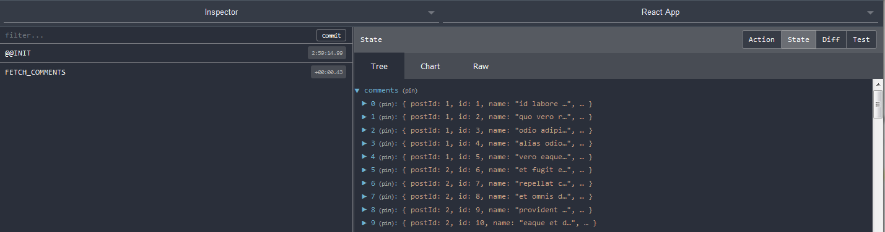
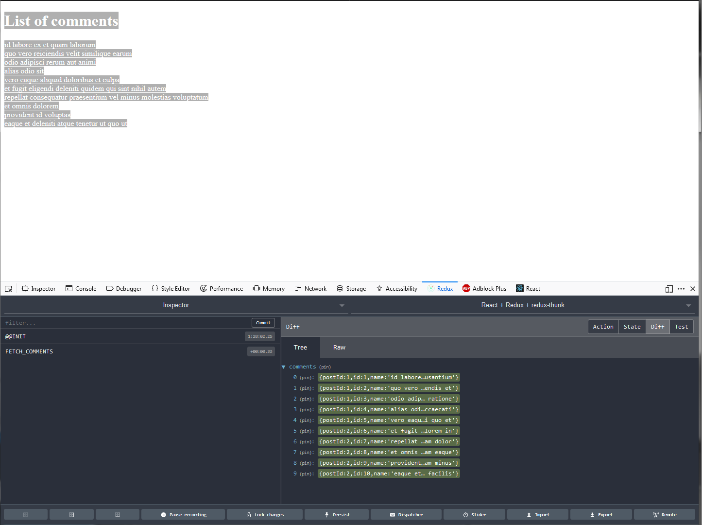
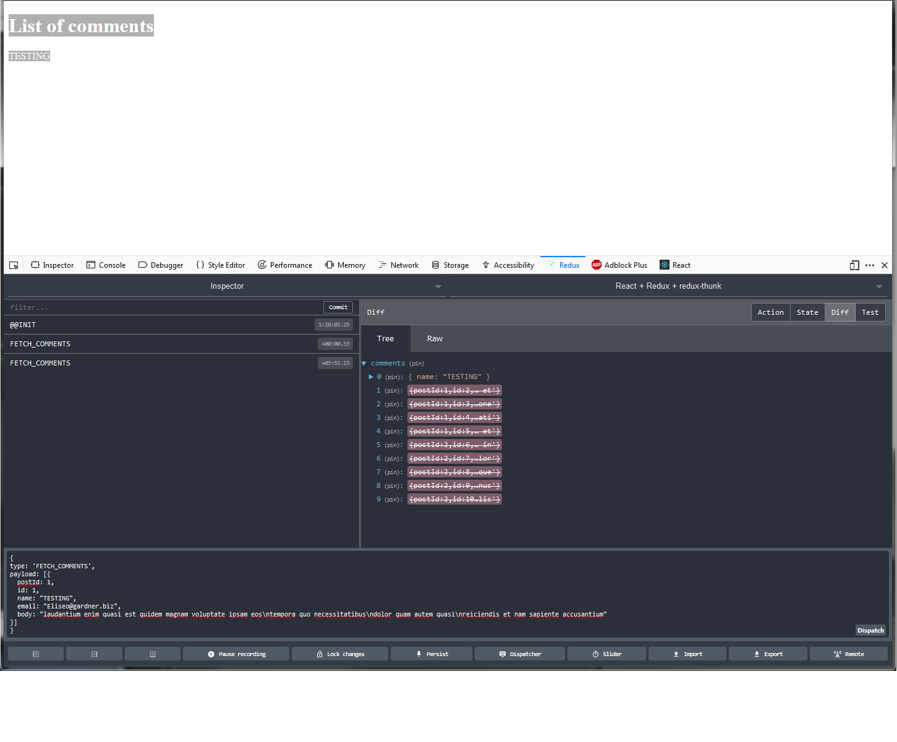

## Redux

<!-- What´s Redux
State in a predictable way.
-->

<!-- TODO: First we should define the store. We have to think how the app will use that data -->

In Redux there´s a single Source of Truth: the store.
The state is read-only (immutable); components cannot write directly into the state.
Reducers create and return a new copy of the state.

When to use Redux...

1. Shared state through multiple Components. Let´s say that we have ComponentA with one child, ComponentB. We can easily pass data down with props. But, if we need to pass the data across several components (example of "prop threading": from A->B->-C->D) we should consider the global state or Redux store so we can instruct (without nesting) which components will have access to that data.
2. Caching: when we want to cache API requests/responses.

For other cases, we should opt for Local State.

#### Pure functions

We make changes in the state through pure functions.

What are Pure Functions...?

1. They depend just in the arguments that we pass.
2. Same arguments should return same results (this makes pure functions easy to test).
3. They don´t produce side effects (aka, NO interaction between the function and its outside scope. Example: HTTP calls)

One common example of pure and impure functions...

**Pure function: slice()**

```javascript
let numbers = [1, 2, 3, 4, 5, 6];
numbers.slice(3, 5);
// Array [ 4, 5 ]

console.log(numbers);
// Array [1,2,3,4,5,6];
```

**Impure function: splice()**

```javascript
let numbers = [1, 2, 3, 4, 5, 6];
numbers.splice(3, 5);
// Array [ 4, 5, 6 ]

console.log(numbers);
// Array [ 1, 2, 3 ];
```

#### Actions, Reducers and the store

To create the store we need at least one reducer which will receive all the actions (dispatched by the store) and return a new state of the application.

##### Actions

They are JS objects that describes an event that should update the application state. A Redux action must include the type property and, optionally, a payload (only send the necessary data).

```javascript
{
  type: 'ADD_TO_TOTAL',
  amount: 10
}
```

Actions can be created (and returned) through **Action Creators**; these functions make the **Actions** portable and easy to test.

Also, for the value of the type property we should opt for CONSTANTS rather than strings (for practicality and to avoid errors related to typos).

```javascript
const ADD_TO_TOTAL = 'ADD_TO_TOTAL';

const addToTotal = amount => ({
  type: ADD_TO_TOTAL,
  amount: 10
});
```

##### Reducers

They are functions that receive 2 arguments: current state and the action that was dispatched. As we said before, they must be pure functions.
They set the original state and return THEN the previous state or a new one.

Important: Please, read it carefully... Reducers must always return the state. We never modify (aka, mutate) the state directly. We create a new copy of the current state, modify the copy and return the copy (original state remains the same).

Every time that we talk about **state** in a Reducer, we are referring to the particular piece of state that the "concerned reducer" is responsible for.

Never mutate the state...
Example: **AVOID doing this**

```javascript
case ADD_TO_TOTAL:
  state.amount = action.amount;
  return state;
```

So... Our reducers will receive ALL actions. Inside the reducer (s) we switch the action by type and return the state for that match.

**src/reducers/sumReducer.js**

```javascript
import { ADD_TO_TOTAL } from '../actions/types';

export default (state = 0, action) => {
  switch (action.type) {
    case ADD_TO_TOTAL:
      return state + action.amount;

    default:
      return state;
  }
};
```

###### Root reducer

`createStore(reducer, [enhancer)` takes a single reducer, so... If we need to pass more than one, we should create a `rootReducer`, a reducer that utilize composition ("combined reducers") to call more than one reducer.

Example:

```javascript
import { combineReducers } from 'redux';
import commentsReducer from './commentsReducer';
import postsReducer from './postsReducer';

const rootReducer = combineReducers({
  comments: commentsReducer,
  posts: postsReducer
});

export default rootReducer;
```

Note: `combineReducers()` will reduce the reducers to a single or main one, which will call every "child reducer" and set/handle each property of our state.

So for the previous reducers the shape of the store will be...

```javascript
{
  comments: [],
  posts: []
}
```

`createStore()` recives as second argument an enhancer. We can provide our `middlewares` using `applyMiddleware()`; this method accept multiple arguments (aka, middlewares)

##### Store

It holds the application state.
It dispatches actions that will hit the reducers which will return the state.

We create the store through the method `createStore(reducer)`

```javascript
import React from 'react';
import { BrowserRouter, Route } from 'react-router-dom';
import ReactDOM from 'react-dom';
import rootReducer from './reducers';
import { Provider } from 'react-redux';
import { createStore } from 'redux';
import App from './App';

const composeEnhancers = window.__REDUX_DEVTOOLS_EXTENSION_COMPOSE__ || compose;

const store = createStore(rootReducer);

ReactDOM.render(
  <Provider store={store}>
    <BrowserRouter>
      <div>
        <Route exact path="/" component={App} />
      </div>
    </BrowserRouter>
  </Provider>,
  document.getElementById('root')
);
```

The `Store` has the following methods:

* `store.getState()` > returns current state of the store
* `store.dispatch(action)` > sends/dispatches the action to all the reducers to return a new property state
* `store.subscribe(callback)` > will execute the callback when the state changes
* `store.replaceReducer(reducer)` > will replace current reducer with the provided one

<!-- TODO: add example for store.replaceReducer(reducer) --->

IMPORTANT: In Redux (as in React or programming in general) you don´t duplicate data. Remember that you have `once Source of Truth`: the Store. Also, put special attention to the shape of the Store... Try to keep it as simple and shallow as you can obviating complex nested structures.

---

**App modularity or skeleton**

Usually, the most common ways to organize our code is through:

* Types
* Features

Personally, for "regular projects" I opt for the following structure...

```
/src
  /actions
  /components/
    Header.js
    Footer.js
  /css
  /data
  /hoc
  images
  /pages/
    Homepage.js
    index.js
    HomeAdvice
  /reducers
  /store
```

So, for example, inside `src/Homepage` (main route) I have my `index.js` where I import reusable components that I store inside `src/components`, but also, those which are particular tied to the `src/Homepage` one like `src/Homepage/HomeAdvice`.

If you want to easily reuse your components in other projects, you should probably go with features. In this case, you will have everything that component needs inside it (aka, its folder).

```
/src/
  Menu.js
  actions.js
  index.js
  reducers.js
```

Sometimes (aka, generally) you are going to have deeply nested paths.
Let´s think in the following case.
We are working in our `Homepage`: `/home/yourUser/yourProject/src/pages/Homepage/index.js` and we want to include our `Footer`: `/home/yourUser/yourProject/src/components/Footer/index.js`

We would do something like...

```javascript
import Footer from '../../components/Footer/index.js';
```

In big projects this can generate confusion. But, you have other option: use `'absolute paths'` instead of `'relative'`.

For this, we are going to create an environment file:`src/.env`

```javascript
NODE_PATH=src/
```

Note: Check in your .gitignore that you are not excluding this file from versioning.

Now, rather than using `../../components/Footer/index.js` we will use `./components/Footer/index.js` starting always from our `src/`

If we place our Components in different folders (let´s say that we move Homepage to `/home/yourUser/yourProject/src/pages/main/Homepage/index.js`) our import statements will not be affected.

<!-- TODO: A little more about .env file -->

---

<!-- TODO: Check React and LAYOUTS -->

##### react-redux

It allows us to dispatch actions and access to our Store from inside our components.
For this, we use the Provider tag and the connect() method.

* Provider wraps our application taking the store as prop, settings the store context and passing it down to child components.
* Connect we can dispatch actions and access to specific parts of our state. It returns a `curried function`.

```javascript
...
connect(mapStateToProps, mapDispatchToProps)(App)
```

Note: **Connected components** (aka, Components using the connect() method) are also called `Smart Components` or `Containers`. Some people place them inside `src/containers/`.

Usually you connect the most parent Component that cares about a particular piece of state.
For example... If you have a **"list of notes"**, you will connect `ListofNotes.js` which is going to pass down as props the particular note to `Note.js`

###### mapStateToProps(state, [ownProps])

Define which data are we going to pass to the component. That data is going to be available through props.

Example:

```javascript
import React, { Component } from 'react';
import { connect } from 'react-redux';
import * as actions from './actions';

class App extends Component {
  componentDidMount() {
    this.props.fetchComments();
  }
  render() {
    return (
      <div>{`Comment with id 1: ${JSON.stringify(
        this.props.comments[0]
      )}`}</div>
    );
  }
}

function mapStateToProps(state) {
  return {
    comments: state.comments
  };
}

export default connect(mapStateToProps, actions)(App);
```

Result:

```javascript
Comment with id 1: {"postId":1,"id":1,"name":"id labore ex et quam laborum","email":"Eliseo@gardner.biz","body":"laudantium enim quasi est quidem magnam voluptate ipsam eos\ntempora quo necessitatibus\ndolor quam autem quasi\nreiciendis et nam sapiente accusantium"}
```

As you can see, we access through `this.props` (Class Component) or `props` (Functional Component).

Remember that you can `destructure`

Example for **Functional Component**

```javascript
const App = ({ comments }) => {
  <div>{`Comment with id 1: ${JSON.stringify(comments[0])}`}</div>;
};
```

Note: Once you load the page, for a fraction of seconds you will see
`Comment with id 1: undefined`; this is because we are dealing with an async operation (an operation that takes some time to resolve).

We can provide a better user experience showing a `loading` message.
Example:

```javascript
{
  !this.props.comments[0]
    ? 'I am loading...'
    : `Comment with id 1: ${JSON.stringify(this.props.comments[0])}`;
}
```

Until `this.props.comments[0]` is something (or, is different than `undefined`), we show the `'I am loading...'` message. It is not a must, but, it offers a better "contextual" interaction.

<!-- TODO: Add `ownProps` fromn React Notes 7 -->

Whether we use `export default connect(mapStateToProps, actions)(App);` (actions object) or `export default connect(mapStateToProps, mapDispatchToProps)(App);` (mapDispatchToProps method), `mapStateToProps` must be something. If we don´t need access to the store, just to `dispatch` we should set it as `null`
Example: `export default connect(null, actions)(App);`

Alternatively, you can replace mapStateToProps with an anonymous function.

So this...

```javascript
export default connect(mapStateToProps, actions)(App);
```

Now would be...

```javascript
export default connect(
  state => {
    return { comments: state.comments };
  },
  { fetchComments }
)(App);
```

If you follow this approach, remember to remove `mapStateToProps`

###### mapDispatchToProps()

Allows us to bind dispatch() to our action creators before they hit the component.

<!-- TODO: Add `mapDispatchToProps()` fromn React Notes 7 -->

---

What is a `curried or partial app`...?
It happens when we call a function without ALL its argument. The result will be a new function which will be waiting for the next argument.

Example:

```javascript
add = a => {
  return b => {
    return a + b;
  };
};

console.log(add(1)(3));
// 4
```

We can simplify it to

```javascript
add = a => b => a + b;

console.log(add(1)(3));
// 4
```

Example passing one value, storing and then passing the other

```javascript
add = a => b => a + b;

const addition = add(1);
console.log(addition);
/*
 function (b) {
    return a + b;
  }
*/

console.log(addition(3));
//4
```

Note: We have 3 functions and we are returning 2 (take this as a general rule)

---

Now... Let´s install some libraries.

```
npm install axios react-redux redux-promise redux --save
```

<!-- TODO: Add to packages
* axios
* react-redux
* redux-promise
* redux
-->

Create the folder **src/reducers** and inside it the following files...

**src/reducers/index.js**

```javascript
import { combineReducers } from 'redux';
import commentsReducer from './commentsReducer';
const rootReducer = combineReducers({
  comments: commentsReducer
});

export default rootReducer;
```

Now, we are going to write our first reducer.

**src/reducers/commentsReducer.js**

```javascript
import { FETCH_COMMENTS } from '../actions/types';

export default (state = [], action) => {
  switch (action.type) {
    case FETCH_COMMENTS:
      return [...state, ...action.payload.data];

    default:
      return state;
  }
};
```

Create the folder **src/actions** and inside it the following files...

**src/actions/types.js**

```javascript
export const FETCH_COMMENTS = 'FETCH_COMMENTS';
```

**src/actions/index.js**

```javascript
import { FETCH_COMMENTS } from './types';

import axios from 'axios';

const api = 'https://jsonplaceholder.typicode.com/';

const headers = {
  Accept: 'application/json'
};

export function fetchComments() {
  const query = 'comments';
  const endPoint = `${api}${query}`;

  const request = axios.get(endPoint, { headers });
  return {
    type: FETCH_COMMENTS,
    payload: request
  };
}
```

Now we are going to wire up our store...

**src/index.js**

```javascript
import React from 'react';
import { BrowserRouter, Route } from 'react-router-dom';
import ReactDOM from 'react-dom';
import rootReducer from './reducers';
import { Provider } from 'react-redux';
import { createStore, applyMiddleware, compose } from 'redux';
import ReduxPromise from 'redux-promise';
import App from './App';

const composeEnhancers = window.__REDUX_DEVTOOLS_EXTENSION_COMPOSE__ || compose;

const store = createStore(
  rootReducer,
  composeEnhancers(applyMiddleware(ReduxPromise))
);

ReactDOM.render(
  <Provider store={store}>
    <BrowserRouter>
      <div>
        <Route exact path="/" component={App} />
      </div>
    </BrowserRouter>
  </Provider>,
  document.getElementById('root')
);
```

And now, in our component (example, App)

```javascript
import React, { Component } from 'react';

import { connect } from 'react-redux';
import { bindActionCreators } from 'redux';
import { fetchComments } from './actions';

const Child = () => {
  return <div>Im Child!</div>;
};

class App extends Component {
  state = {
    friend: '',
    friends: []
  };

  componentDidMount() {
    this.props.fetchComments();
  }

  updateStateProperty = (stateProperty, statePropertyValue) => {
    this.setState({ [stateProperty]: statePropertyValue });
  };

  submitHandler = e => {
    e.preventDefault();

    this.setState(previousState => {
      return {
        friends: [...previousState.friends, this.state.friend],
        friend: ''
      };
    });
  };

  render() {
    const { friend } = this.state;
    const { fetchComments } = this.props;
    return (
      <div>
        <h1 className="title">Add your friends!</h1>
        <form onSubmit={this.submitHandler}>
          <input
            type="text"
            name="friend"
            value={friend}
            onChange={event =>
              this.updateStateProperty(event.target.name, event.target.value)
            }
          />
          <button>Add friend!</button>
        </form>
        <Child />
      </div>
    );
  }
}

function mapStateToProps(state) {
  return {
    comments: state.comments
  };
}

function mapDispatchToProps(dispatch) {
  return bindActionCreators({ fetchComments }, dispatch);
}

export default connect(mapStateToProps, mapDispatchToProps)(App);
```

If we check our Redux DevTools console...



Note: remember that we can destructure or pull properties from objects.
So...

```javascript
function mapStateToProps(state) {
  return {
    comments: state.comments
  };
}
```

Can be replaced with...

```javascript
function mapStateToProps({ comments }) {
  return {
    comments
  };
}
```

Since key and value are the same (comments) we can simplify it just to `comments`

... and, since we love ES6, we can use `fat arrow function` and return our `object`

```javascript
const mapStateToProps = ({ comments }) => {
  return {
    comments
  };
};
```

---

Note: reducers immutability
In our commentsReducer.js for the action.type "FETCH_COMMENTS" we are returning the previous state and appending the "new" payload.

You could be tempted to do something like: return action.payload.data instead. however, through an easy example I will show you why you should not.

In your commentsReducer.js change...

```javascript
case FETCH_COMMENTS:
  return [...state, ...action.payload.data];
```

<!-- TODO: Explain WHY return [...state, ...action.payload.data];
We are receiving an array of objects. That´s why in our test payload we use payload: [{}] -->

with...

```javascript
case FETCH_COMMENTS:
  return action.payload.data;
```

Go to http://localhost:3000/

You will see the list of comments.



Now, open your `Dev console`; go to the `Redux tab` and click on `Dispatcher`.
Copy and paste the following Action...

```
{
type: 'FETCH_COMMENTS',
payload: {
  data: [{
    postId: 1,
    id: 1,
    name: "TESTING",
    email: "Eliseo@gardner.biz",
    body: "laudantium enim quasi est quidem magnam voluptate ipsam eos\ntempora quo necessitatibus\ndolor quam autem quasi\nreiciendis et nam sapiente accusantium"
  }]}
}
```

... and click on Dispatch.



Dispatch as many times as you want. What is going on...? Every time you dispatch, you are "cleaning" the previous state and setting the payload as the new value of your state property, in our case, comments.

Now, in your commentsReducer.js replace your return with the original one:

```javascript
case FETCH_COMMENTS:
  return [...state, ...action.payload.data];
```

Using the same `Action`, dispatch. You can see the difference. Now, you are preserving the previous state appending the new Object. The more you dispatch the action we have in our Redux Dispatcher, the more times you will see the property of that object on screen. I did it 3 times and this is what my component is rendering...

```
List of comments
id labore ex et quam laborum
quo vero reiciendis velit similique earum
odio adipisci rerum aut animi
alias odio sit
vero eaque aliquid doloribus et culpa
et fugit eligendi deleniti quidem qui sint nihil autem
repellat consequatur praesentium vel minus molestias voluptatum
et omnis dolorem
provident id voluptas
eaque et deleniti atque tenetur ut quo ut
TESTING
TESTING
TESTING
```

---

#### Architectural advice...

Currently, our `comments` piece of state is an array of objects. This is "good enough" for this App, however, it doesn´t scale neither perform properly for big projects. You should always opt for objects with IDs as keys (aka, normalized state) instead of array.

Using `lodash`, we can take advantage of `_.mapKeys(object, key)`. So, in our reducer first we will import `import _ from "lodash";` and then, we will change...

Old:

```javascript
case FETCH_COMMENTS:
  return action.payload.data;
```

New:

```javascript
case FETCH_COMMENTS:
  return _.mapKeys(action.payload.data, 'id');
```

So... We will pass from this...

```javascript
[
  {
    postId: 1,
    id: 1,
    name: 'id labore ex et quam laborum',
    email: 'Eliseo@gardner.biz',
    body:
      'laudantium enim quasi est quidem magnam voluptate ipsam eos\ntempora quo necessitatibus\ndolor quam autem quasi\nreiciendis et nam sapiente accusantium'
  },
  {
    postId: 1,
    id: 2,
    name: 'quo vero reiciendis velit similique earum',
    email: 'Jayne_Kuhic@sydney.com',
    body:
      'est natus enim nihil est dolore omnis voluptatem numquam\net omnis occaecati quod ullam at\nvoluptatem error expedita pariatur\nnihil sint nostrum voluptatem reiciendis et'
  }
];
```

To this...

```javascript
{
    "1": {
        "postId": 1,
        "id": 1,
        "name": "id labore ex et quam laborum",
        "email": "Eliseo@gardner.biz",
        "body": "laudantium enim quasi est quidem magnam voluptate ipsam eos\ntempora quo necessitatibus\ndolor quam autem quasi\nreiciendis et nam sapiente accusantium"
    },
    "2": {
        "postId": 1,
        "id": 2,
        "name": "quo vero reiciendis velit similique earum",
        "email": "Jayne_Kuhic@sydney.com",
        "body": "est natus enim nihil est dolore omnis voluptatem numquam\net omnis occaecati quod ullam at\nvoluptatem error expedita pariatur\nnihil sint nostrum voluptatem reiciendis et"
    }
}
```

Note: `key` is the property of the object that we want for our new object property. We could use name, email, etc... But, we opted for `id` since we need something unique.

At this point -probably- you are thinking... How will I map that object state...?

And here´s where we use `lodash` (or `_`) again.
Having the piece of state with a new shape we can use `_.map(object)`
So, for example, in our `App.js` we are going to include as first step. Next, we will create a method for render our comments and we will call that function from our JSX.

```javascript
renderComments() {
  return _.map(this.props.comments, comment => {
    return <li key={comment.id}>{`Title: ${comment.name}`}</li>;
  });
}
```

And, as we said, inside our returned JSX...

```javascript
{
  this.renderComments();
}
```

Example result:

```javascript
Title: id labore ex et quam laborum
Title: quo vero reiciendis velit similique earum
Title: odio adipisci rerum aut animi
Title: alias odio sit
Title: vero eaque aliquid doloribus et culpa
Title: et fugit eligendi deleniti quidem qui sint nihil autem
Title: repellat consequatur praesentium vel minus molestias voluptatum
Title: et omnis dolorem
Title: provident id voluptas
...
...
...
```

---

Now, instead of dispatching in our Component we are going to resolve the promise and dispatch from our action creator using `redux-thunk` (we were using `redux-promise` to return an action with the payload property and a promise as value).

We have to add redux-thunk middleware to our **src/index.js**

```javascript
const store = createStore(
  rootReducer,
  //composeEnhancers(applyMiddleware(ReduxPromise))
  composeEnhancers(applyMiddleware(reduxThunk))
);
```

Go to **src/actions/index.js**

```javascript
import { FETCH_COMMENTS } from './types';

import axios from 'axios';

const api = 'https://jsonplaceholder.typicode.com/';

const headers = {
  Accept: 'application/json'
};

export const fetchComments = () => dispatch => {
  const query = 'comments';
  const endPoint = `${api}${query}`;

  return axios.get(endPoint, { headers }).then(response => {
    dispatch({ type: FETCH_COMMENTS, payload: response.data });
  });
};
```

Go to **src/reducers/commentsReducer.js** and replace

```javascript
return [...state, ...action.payload];
```

with

```javascript
return Object.assign({}, state, _.mapKeys(action.payload, 'id'));
```

<!-- TODO: Explain return Object.assign({}, state, _.mapKeys(action.payload, 'id')); -->

Go to your component, example: **src/App.js** and...

Remove...

```javascript
function mapDispatchToProps(dispatch) {
  return bindActionCreators({ fetchComments }, dispatch);
}
```

Replace...

```javascript
export default connect(mapStateToProps, mapDispatchToProps)(App);
```

with...

```javascript
export default connect(mapStateToProps, { fetchComments })(App);
```

Check your Redux DevTools. You should have the same results as previously.

---

Several times we referred to Middlewares...
**What is a Middleware...?** Is Logic that intercepts a process (or request) producing a side effect. Middlewares can be chained.
In Redux we use Middlewares to intercept dispatched
actions modifying them (or not) before they hit the reducers. We can also dispatch other actions or execute some logic at the dispatching time or layer.

What is `redux-thunk`...? It´s a thunk middleware for Redux. We can use it for async HTTP requests (Redux only supports synchronous data flow) for example, when we are dealing/interacting with a server, delaying, dispatching, or dispatching if certain condition is met (like a response to our request).

With thunks we can return from the action creator a function instead of an object and intercept these actions before dispatching.
