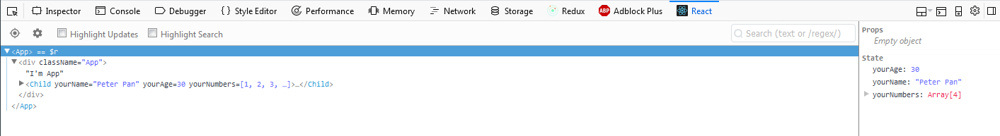
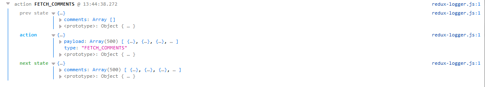

## Packages

### PropTypes

Used to check props passed to our components against definitions.
This dependency works just in `development`
If *we want* to use validation in `production` (we should not), we can choose to use the development version by importing/requiring prop-types/prop-types instead of prop-types.
*More info:* https://www.npmjs.com/package/prop-types

CMD or terminal:

```
npm install --save prop-types
```

Example use:

```javascript
import React, { Component } from 'react';
import PropTypes from 'prop-types';

const Child = props => <div>Im Child...</div>;

class App extends Component {
  state = {
    yourName: 'Peter Pan',
    yourAge: 30,
    yourNumbers: [1, 2, 3, 4]
  };

  render() {
    return (
      <div className="App">
        Im App
        <Child {...this.state} />
      </div>
    );
  }
}

Child.propTypes = {
  yourName: PropTypes.string,
  yourAge: PropTypes.number,
  yourNumbers: PropTypes.array
};

export default App;
```

If you don´t have installed React Developer Tools, please, install it now:

* Firefox:https://addons.mozilla.org/en-US/firefox/addon/react-devtools/
* Chrome: https://chrome.google.com/webstore/detail/react-developer-tools/fmkadmapgofadopljbjfkapdkoienihi?hl=en

Refresh the page and open your Browser Developer Tools.
Click in the React tab and expand your App view.



You can see that the App component has the following properties in its State:

```javascript
State
    yourAge: 30
    yourName:"Peter Pan"
    yourNumbers: Array[4]
      0: 1
      1: 2
      2: 3
      3: 4
```

And, if you click in Child, you will see the following properties...

```javascript
Props read-only
    yourAge: 30
    yourName: "Peter Pan"
    yourNumbers: Array[4]
```

Great! Everything is working as expected, however, we are not checking yet if PropTypes is working.

Return to your Console tab.
Refresh the page. You should not see any error.

Now, change the expected type of yourAge property to string

```javascript
Child.propTypes = {
  yourName: PropTypes.string,
  yourAge: PropTypes.string,
  yourNumbers: PropTypes.array
};
```

In the Console you will see...

```javascript
Warning: Failed prop type: Invalid prop `yourAge` of type `number` supplied to `Child`, expected `string`.
    in Child (at App.js:17)
    in App (at index.js:7)
```

Excellent! Everything is working as expected (aka, every time you use a type different than the one defined, you will see a warning in your console). Change other properties and ensure that you understand what´s happening. Once you finish, please, be sure that you are setting the right types.

##### Most used types...

```javascript
optionalArray: PropTypes.array,
optionalBool: PropTypes.bool,
optionalFunc: PropTypes.func,
optionalNumber: PropTypes.number,
optionalObject: PropTypes.object,
optionalString: PropTypes.string,
optionalSymbol: PropTypes.symbol
```

You can define IF a property is required with `.isRequired`

```javascript
Child.propTypes = {
  yourName: PropTypes.string,
  yourAge: PropTypes.number.isRequired,
  yourNumbers: PropTypes.array
};
```

In this case, if you don´t have that property you console will show something like...

```javascript
Warning: Failed prop type: The prop `yourAge` is marked as required in `Child`, but its value is `undefined`.
    in Child (at App.js:17)
    in App (at index.js:7)
```

For `class-based` components, usually you will see `propTypes` as a *static property* of the class.

```javascript
class Child extends Component {
  static propTypes = {
    yourName: PropTypes.string,
    yourAge: PropTypes.number.isRequired,
    yourNumbers: PropTypes.array
  }
  render() {
    return ...
  }
}
```

---

I recommend you to install as well Redux DevTools.

* Firefox: https://addons.mozilla.org/es/firefox/addon/remotedev/
* Chrome: https://chrome.google.com/webstore/detail/redux-devtools/lmhkpmbekcpmknklioeibfkpmmfibljd?hl=en

Once you have this Add-on, you can wire it up to your store using it as second parameter of `createStore()`

```javascript
const store = createStore(
  reducer,
  window.__REDUX_DEVTOOLS_EXTENSION__ && window.__REDUX_DEVTOOLS_EXTENSION__()
);
```

---

### Escape RegExp

Used to escape RegExp special characters.
More info: https://www.npmjs.com/package/escape-string-regexp

CMD or terminal:

```
npm install --save escape-string-regexp
```

Example use:

```javascript
import React, { Component } from 'react';
import PropTypes from 'prop-types';
import escapeStringRegexp from 'escape-string-regexp';

class App extends Component {
  state = {
    yourName: ''
  };

  handleSubmit = event => {
    event.preventDefault();

    this.setState(prevState => {
      return {
        yourName: escapeStringRegexp(prevState.yourName)
      };
    });

    // Here the Logic or WHAT to do with the data
  };

  render() {
    const { yourName } = this.state;

    return (
      <div className="App">
        <form onSubmit={this.handleSubmit}>
          <span>Your name: </span>
          <input
            type="text"
            value={this.state.yourName}
            onChange={event => this.setState({ yourName: event.target.value })}
          />
          <button>Submit</button>
        </form>
      </div>
    );
  }
}

export default App;
```

Type some symbols like: $!#%&/()=?¡'+
Then, in the React tab of your Dev Tools check the State... You should see:

```javascript
State;
yourName: "$!#%&/()=?¡'+";
```

Now, hit Submit and check (again) the value of yourName property.
You should see:

```javascript
State;
yourName: "\\$!#%&/\\(\\)=\\?¡'\\+";
```

Bravo...! You know how to escape characters.

---

### React Router

Declarative routing for React.
More info: https://www.npmjs.com/package/react-router

```
npm install --save react-router
```

Note: This package provides the core routing functionality for React Router, but you might not want to install it directly. If you are writing an application that will run in the browser, you should instead install react-router-dom. Similarly, if you are writing a React Native application, you should instead install react-router-native. Both of those will install react-router as a dependency.

Since we are just caring about a WebApp (an app that will run in a browser) we are going to use react-router-dom.

CMD or terminal:

```
npm install --save react-router-dom
```

Example use:

```
import React, { Component } from 'react';
import { BrowserRouter, Route, Link } from 'react-router-dom';
import ReactDOM from 'react-dom';
import App from './App';

ReactDOM.render(
  <BrowserRouter>
    <div>
      <Route
        path="/search"
        render={() => (
          <div>
            Searching...?
            <Link to="/">Go home!</Link>
          </div>
        )}
      />
      <Route exact path="/" component={App} />
    </div>
  </BrowserRouter>,
  document.getElementById('root')
);
```

Why we use exact for "/"...?
If we don´t add the exact attribute, both screens will render when we go to the main route "/".

An example to clarify.
All these routes will match http://localhost:3000/animals/dogs

```javascript
<Route path="/" component={Something} />
<Route path="/animals" component={Something} />
<Route exact path="/animals/dogs" component={Something} />
<Route path="/animals/dogs" component={Something} />
```

Alternatively, we can use Switch which takes a collection of different routes and it just renders the first route that matches the URI.
Example:

```javascript
<BrowserRouter>
  <Switch>
    <Route path="/animals" component={App0} />
    <Route path="/animals/dogs" component={App1} />
    <Route path="/" component={App} />
  </Switch>
</BrowserRouter>
```

In the previous example...

* http://localhost:3000/ will render App
* http://localhost:3000/animals will render App0
* http://localhost:3000/animals/dogs will render App0

... and YES, **you do also need to set the routes by granularity** (or specification) to have the expected results...

Example with routes in "proper order":

```javascript
<Switch>
  <Route path="/animals/dogs" component={App1} />
  <Route path="/animals" component={App0} />
  <Route path="/" component={App} />
</Switch>
```

Now...

* http://localhost:3000/ will render App
* http://localhost:3000/animals will render App0
* http://localhost:3000/animals/dogs will render App1

What happens if we try: http://localhost:3000/animals/cat...?
It will render **App0**.

Add `<Route path="/animals/:animal" component={App1} />` at the top. Now, everything that matches the patten `/animals/:animal` (including `/animals/dogs`) will render **App1**.

Note: When we use ReactRouter we are rendering a Router component and passing to it a history prop.

If you open the React DevTools you will see something like this...


Route component takes a path and renders its proper UI.

Let´s go back to our `<Switch>` example for a moment. Through the URI we can get the `animal` that the user is passing (`/animals/:animal`) and execute some operation. For example, make a request to x-API to retrieve all the information related to that animal. To ilustrate the point, in **App1** I´m, adding...

```javascript
class App1 extends Component {
  componentDidMount() {
    const { animal } = this.props.match.params;
    this.props.fetchPost(animal);
  }

  render() {
    return (
      <div>
        <div>{JSON.stringify(this.props.match)}</div>
      </div>
    );
  }
}
```

In the Lifecycle `componentDidMount()` we are making the request via `this.props.fetchPost(animal);`.

In the JSX, I´m printing as well the `match` property which its parsed-value would be:

```javascript
{
   "path":"/animals/:animal",
   "url":"/animals/cat",
   "isExact":true,
   "params":{
      "animal":"cat"
   }
}
```

---

We don´t use <a> if not Link which keeps sync with BrowserRouter; Link renders an anchor tag.
We can pass parameters to Link using an object instead of a string as value.

```javascript
<BrowserRouter>
  <div>
    <Route
      path="/home"
      render={() => (
        <div>
          <Link
            to={{
              pathname: '/search',
              search: '?sort=date',
              hash: '#the-hash'
            }}
          >Advanced Search
          </Link>
        </div>
      )}
    />
  </div>
</BrowserRouter>,
```

---

### Redux logger

We use redux-logger to log the actions and the state (after and before that action)

More info and "how to create your own logger": https://www.npmjs.com/package/redux-logger

CMD or terminal:

```
npm install --save redux-logger
```

IMPORTANT: logger must be the last middleware in chain, otherwise it will log thunk and promise, not actual actions

Example:

```javascript
import logger from 'redux-logger';

...
const store = createStore(
  rootReducer,
  composeEnhancers(applyMiddleware(reduxThunk, logger))
);
...
```

If you check your console you will see...



---

### Redux Thunk

Thunk middleware for Redux.

More info: https://www.npmjs.com/package/redux-thunk

CMD or terminal:

```
npm install --save redux-thunk
```

Example:

<!-- TODO: redux-thunk example + check Notes 7 -->

<!-- TODO: Check for reselect -->

---

### Axios

Promise based HTTP client for the browser and node.js

More info: https://www.npmjs.com/package/axios

CMD or terminal:

```
npm install --save axios
```

Example:

**Action creator**

```javascript
export const FETCH_COMMENTS = 'FETCH_COMMENTS';

export const fetchComments = () => {
  const api = 'https://jsonplaceholder.typicode.com/comments';
  const request = axios.get(api);

  return {
    type: FETCH_WEATHER,
    payload: request
  };
};
```

**Reducer**

```javascript
import { FETCH_COMMENTS } from '../actions/types';

export default (state = [], action) => {
  switch (action.type) {
    case FETCH_COMMENTS:
      return action.payload.data;

    default:
      return state;
  }
};
```

Remember that `axios` returns a `promise` (in our example passed it as the value of payload property) that we have to resolve.

Note: In some of our examples we use `redux-promise` which, with `axios`, it "checks" the `payload` property of the `actions`, and if this payload is a `promise`, redux-promise (middleware) stops the action, wait until the request finishes and **then** dispatches a **NEW action** but with the **same type** property and for payload, the request properly resolved. This new action will follow its logic course and hit the reducers.
