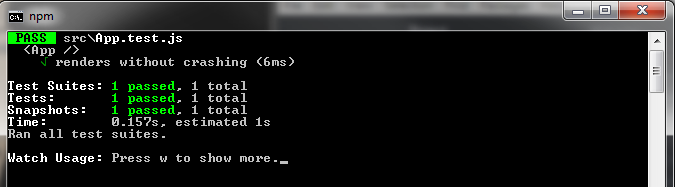
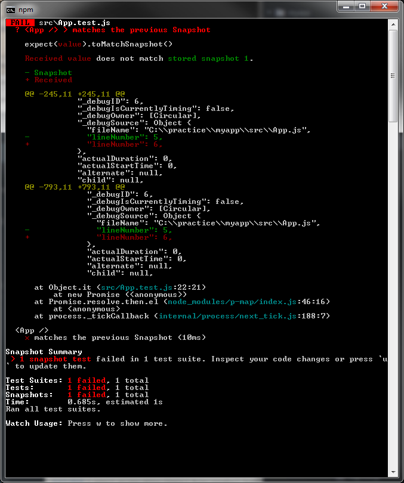
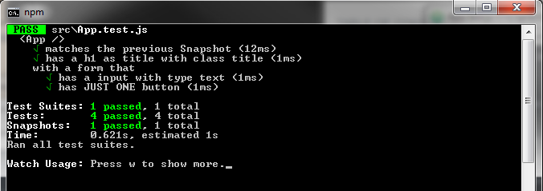
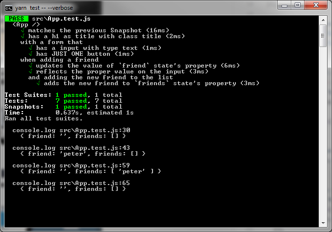
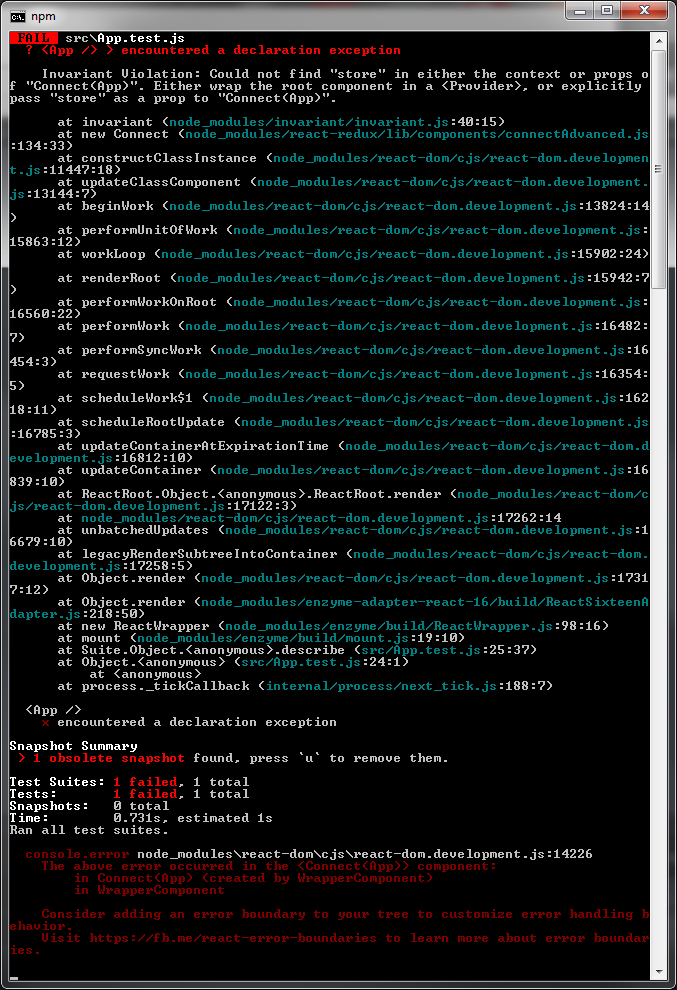
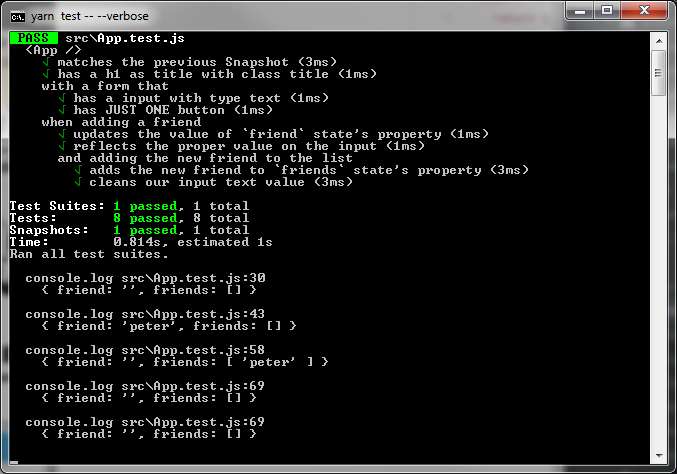

## Unit Tests

<!-- TODO: What´s Unit Test -->

I recommend you to follow the TDD (Test Driven Development)
You start writing the boiler-plate of your Unit Test, then you run the test which will fail and it will determine the feature that you should add to your script/program... and so on.

When you use create-react-app you are wiring up -as well- Jest (Facebook's test runner).
Your files should have the extension \*.test.js or be inside \_\_tests\_\_

In our examples we will use -also- [Enzyme](http://airbnb.io/enzyme/docs/api/) (Airbnb's React testing library).

First, install enzyme and the proper adapter (we are using React 16).

CMD or terminal:

```
npm install enzyme enzyme-adapter-react-16 jest-cli@20.0.4 --save-dev  
```

Yes... We are saving it as a dev dependency. So, if you go to your package.json you will see something like:

```json
"devDependencies": {
  "enzyme": "^3.3.0",
  "enzyme-adapter-react-16": "^1.1.1",
  "jest-cli": "^20.0.4"
}
```

Note: At the moment I´m writing this tutorial the last Jest version is 23.4.1, however, react-scripts is locked at 20.0.4 so other will not work.

We are going to create **src/tempPolyfills.js**

```javascript
const requestAnimationFrame = (global.requestAnimationFrame = callback => {
  setTimeout(callback, 0);
});
export default requestAnimationFrame;
```

And, **src/setupTests.js**

```javascript
import requestAnimationFrame from './tempPolyfills';

/* Some people avoid destructuring this:
import Enzyme from 'enzyme';
And then...
Enzyme.configure({ adapter: new Adapter(), disableLifecycleMethods: true  });
*/
import { configure } from 'enzyme';

import Adapter from 'enzyme-adapter-react-16';
configure({ adapter: new Adapter(), disableLifecycleMethods: true });
```

---

Note: When you create your app using `create-react-app` your `App.test.js` will look like...

```javascript
import React from 'react';
import ReactDOM from 'react-dom';
import App from './App';

it('renders without crashing', () => {
  const div = document.createElement('div');
  ReactDOM.render(<App />, div);
  ReactDOM.unmountComponentAtNode(div);
});
```

Once you run this test, a fake div will be created (in the memory of our terminal) and our component will be rendered inside this container (or node).
Then, the mounted Component will be removed.

---

### Snapshots

Snapshots are a recorded history of our Component to verify that previous "captures" match current ones after changes (so, we prevent unwanted changes).

Create the file src/App.test.js (if you have it, delete ALL its content)

```javascript
import React from 'react';
import ReactDOM from 'react-dom';
import { mount } from 'enzyme';
import App from './App';

describe('<App />', () => {
  const wrapper = mount(<App />);

  it('matches the previous Snapshot', () => {
    expect(wrapper).toMatchSnapshot();
  });
});
```

---

Notes:
We use `describe` to group test. We can nest describes to tie (as well) sub-groups. We will see this in behavioral tests.
We use `it` for each test.

---

Run your tests...

```
npm test
```

You can also use yarn (yarn test)

The result will be...



You will see in your root dir, in our case, src a new folder **\_\_snapshots\_\_**
If you are going to be working with several people, exclude this folder from Git. In this case, add the following rule to your **.gitignore**

```
# testing
**/__snapshots__
```

Feel free to check the structure of your Snapshot. Go to **src/\_\_snapshots/App.test.js.snap**

Now, make a small change in your App Component. Just add a comment inside your class.
If you check your console you will see something like...



As it says, just hit u (update) and all your test will be green (status = passed) again.

### Coverage

We can use Jest´s functionality to corroborate the coverage (%) of our UT.

CMD or terminal:

```
npm test -- --coverage
```

Result:


### Structural Testing

### BDD: Behavior Driven Development

We are going to make several changes in our App Component.

**src/App.js**

```javascript
import React, { Component } from 'react';

class App extends Component {
  state = {
    friend: '',
    friends: []
  };

  updateStateProperty = (stateProperty, statePropertyValue) => {
    this.setState({ [stateProperty]: statePropertyValue });
  };

  submitHandler = e => {
    e.preventDefault();

    this.setState(previousState => {
      return {
        friends: [...previousState.friends, this.state.friend],
        friend: ''
      };
    });
  };

  render() {
    const { friend } = this.state;
    return (
      <div>
        <h1 className="title">Add your friends!</h1>
        <form onSubmit={this.submitHandler}>
          <input
            type="text"
            name="friend"
            value={friend}
            onChange={event =>
              this.updateStateProperty(event.target.name, event.target.value)
            }
          />
          <button>Add friend!</button>
        </form>
      </div>
    );
  }
}

export default App;
```

This is a Controlled Component: local state property sets the value for the input. Then, when clicking, that value populates to the property friends (graving the previous state and appending the new one at the end of the array) "cleaning" (aka, setting to empty string) the value of the state property friend.

Now, we have to add the proper UT.
I will start testing...

* That I have a title which is an h1 with class title
* That I have an input which type is text
* That I have JUST ONE button

You can also check the existence of the form tag. I´m letting this one as homework :)

**src/App.test.js**

```javascript
import React from 'react';
import ReactDOM from 'react-dom';
import { mount } from 'enzyme';
import App from './App';

describe('<App />', () => {
  const wrapper = mount(<App />);

  it('matches the previous Snapshot', () => {
    expect(wrapper).toMatchSnapshot();
  });

  it('has a h1 as title with class title', () => {
    expect(wrapper.find('h1.title').exists()).toBe(true);
  });

  describe('with a form that', () => {
    it('has a input with type text', () => {
      expect(wrapper.find('[type="text"]').exists()).toBe(true);
    });
    it('has JUST ONE button', () => {
      expect(wrapper.find('button')).toHaveLength(1);
    });
  });
});
```

And, the SC of our console...



Great job!

We have to test the behavior or functionality.

* That we have a Controlled Component: input data will update friend state property and be reflected as the value of the input element.
* That submitting the form should update the friends state property with the value of friend and set -then- the value of friend to empty string.

<!-- TODO: pollution issues
-->

Note: beforeEach(() => {} and afterEach(() => {} will execute functionality before/ater each IT on their scope.

<!-- TODO: Maybe an example can clarify the scope -->

Let´s include the new tests to **src/App.test.js**

```javascript
import React from 'react';
import ReactDOM from 'react-dom';
import { mount } from 'enzyme';
import App from './App';

describe('<App />', () => {
  const wrapper = mount(<App />);

  it('matches the previous Snapshot', () => {
    expect(wrapper).toMatchSnapshot();
  });

  it('has a h1 as title with class title', () => {
    expect(wrapper.find('h1.title').exists()).toBe(true);
  });

  describe('with a form that', () => {
    it('has a input with type text', () => {
      expect(wrapper.find('[type="text"]').exists()).toBe(true);
    });
    it('has JUST ONE button', () => {
      expect(wrapper.find('button')).toHaveLength(1);
    });
  });

  describe('when adding a friend', () => {
    let theFriend = 'peter';

    // Initial state
    console.log(wrapper.state());

    // We add to the peter to the `friend` state´s property
    beforeEach(() => {
      // I´m adding the name to keep the behavior of my method: updateStateProperty
      wrapper.find('input').simulate('change', {
        target: { name: 'friend', value: theFriend }
      });

      wrapper.update();
    });

    it('updates the value of `friend` state´s property', () => {
      console.log(wrapper.state());
      expect(wrapper.state().friend).toEqual(theFriend);
    });

    it('reflects the proper value on the input', () => {
      expect(wrapper.find('[type="text"]').prop('value')).toEqual(theFriend);
    });

    describe('and adding the new friend to the list', () => {
      beforeEach(() => {
        // Yes... We simulate the event from the button
        // Our submit handler will clear as well `friend` state´s property
        wrapper.find('button').simulate('submit');
      });

      it('adds the new friend to `friends` state´s property', () => {
        console.log(wrapper.state());
        expect(wrapper.state().friends[0]).toEqual(theFriend);
      });
      // Now we want to clear our `friends` state´s property or set it to the initial state
      afterEach(() => {
        wrapper.setState({ friends: [] });
        console.log(wrapper.state());
      });
    }); // close describe: and adding the new friend to the list
  }); // close describe: when adding a friend
});
```

Now, if you run the tests your console will look like...



Notes:

```javascript
beforeEach(() => {
  // I´m adding the name to keep the behavior of my method: updateStateProperty
  wrapper.find('input').simulate('change', {
    target: { name: 'friend', value: theFriend }
  });

  wrapper.update();
});
```

We are using `wrapper.update();` to force our Component to update or re-render so we can be sure that the state was updated (or set with `setState()`, which is an async operation) and our input value reflects what the state property holds (remember controlled forms logic).

We are printing our state several times with console.log(wrapper.state()) so you can see clearly the changes in each instance.
Reserved words like const and object properties (in our example friend and friend) should be between backtick (\`\`).
If we are targeting an element among several, for example, if we had 2 or more buttons, we could refer to the particular button (the one that we use to submit) through class, id... or, using .at(position)...

Example: to find the first button

```javascript
wrapper
  .find('button')
  .at(0)
  .simulate('submit');
```

We can also nest element. Example:

```html
<div>
  <h1>Hello</h1>
</div>
```

UT:

```javascript
it('renders an h1 title', () => {
  expect(wrapper.find('div h1').text()).toEqual('Hello');
});
```

#### Shallow Rendering (Shallow), Full Rendering (Mount) and Static Rendering (Render)

Let´s add first a functional component to the previous **src/App.js** code

```javascript
const Child = () => {
  return <div>Im Child!</div>;
};
```

**Render**
It renders the provided Component returning HTML.
It uses a third party HTML parsing and traversal library [cheerio](https://cheerio.js.org/)

<!-- TODO: When to use each one, particularly Render -->

Now, let´s console the structure of the Component using `shallow` and `mount`

**Shallow**
It renders the provided Component but NOT its children.

```javascript
import React from 'react';
import { shallow } from 'enzyme';
import App from './App';

describe('<App />', () => {
  const wrapper = shallow(<App />);

  it('matches the previous Snapshot', () => {
    expect(wrapper).toMatchSnapshot();
    console.log(wrapper.debug());
  });
});
```

Result:

```javascript
<div>
  <h1 className="title">Add your friends!</h1>
  <form onSubmit={[Function]}>
    <input
      type="text"
      name="friend"
      value=""
      onChange={[(Function: onChange)]}
    />
    <button>Add friend!</button>
  </form>
  <Child />
</div>
```

Note: Remember that console.log(wrapper.debug()); prints in the console (aka, your CMD or terminal) the component´s structure.

**Render**

```

```

<!-- TODO: Add render -->

**Mount**
It renders the provided Component and its children.

<!-- TODO: Something else to add...? -->

Just replace shallow with mount.

Result:

```javascript
<App>
  <div>
    <h1 className="title">Add your friends!</h1>
    <form onSubmit={[Function]}>
      <input
        type="text"
        name="friend"
        value=""
        onChange={[(Function: onChange)]}
      />
      <button>Add friend!</button>
    </form>
    <Child>
      <div>I&#39;m Child!</div>
    </Child>
  </div>
</App>
```

<!-- TODO: Difference between Shallow and Mount -->

<!-- TODO: Issue with <Link> and Mount-->

### Connected components

<!-- TODO: Check final link to Redux.md -->

We are going to use the example that we have in our Redux chapter.
We tested the structural and behavioral part earlier. However, try to run the test again.

You will see...



So first, let´s delimit the context changing (in our test) mount with shallow.
Now, we are going to export our class (or function) to test the component itself rather than the connected component.

We will have 2 exports (one by default, the connected component)

**src/components/App.js**

```javascript
...
export class App extends Component {}

...
export default connect(mapStateToProps, mapDispatchToProps)(App);
```

In our UT we will destructure from our component the unconnected version.

So we will replace...

**src/components/App.test.js**

```javascript
import App from './App';
```

with...

```javascript
import { App } from './App';
```

Hit `u` to update your Snapshot.
Your console will look like...


As you can see, we are getting closer to the solution.
Now, replace the UT...

```javascript
beforeEach(() => {
  // Yes... We simulate the event from the button
  // Our submit handler will clear as well `friend` state´s property
  wrapper.find('button').simulate('submit');
  wrapper.update();
});
```

with...

```javascript
beforeEach(() => {
  wrapper.find('form').simulate('submit', { preventDefault() {} });
  wrapper.update();
});
```

Your tests should be green again...



Remember that we exported the class to fix the issue related with the context of our store.

We can also create a separated component for our store (initializing it with the `Provider` tag or Component) and including it in both, our main file, example `src/index.js` and the "connected component tests".

In this case (aka, how to fix the issue with the store´s context option b) we can enhance `Provider`.

<!-- TODO: HOC of a HOC -->

**src/ProviderEnhancement.js**

```javascript
import React from 'react';
import { Provider } from 'react-redux';
import { createStore, applyMiddleware, compose } from 'redux';
//import reduxPromise from 'redux-promise';
import logger from 'redux-logger';
import reduxThunk from 'redux-thunk';
import reducers from './reducers';

const composeEnhancers = window.__REDUX_DEVTOOLS_EXTENSION_COMPOSE__ || compose;

export default ({ children, initialState = {} }) => {
  const store = createStore(
    reducers,
    initialState,
    composeEnhancers(applyMiddleware(reduxThunk, logger))
  );
  return <Provider store={store}>{children}</Provider>;
};
```

Now, we are going to import `Provider_Enhancement.js` in our `src/index.js` and wrap our JSX replacing `Provider` with the given namespace.

And remove the following...

```javascript
import rootReducer from './reducers';
import { Provider } from 'react-redux';
import { createStore, applyMiddleware, compose } from 'redux';
//import ReduxPromise from 'redux-promise';
import reduxThunk from 'redux-thunk';
import logger from 'redux-logger';
const composeEnhancers = window.__REDUX_DEVTOOLS_EXTENSION_COMPOSE__ || compose;
```

Plus...

```javascript
const store = createStore(
  rootReducer,
  //composeEnhancers(applyMiddleware(ReduxPromise))
  composeEnhancers(applyMiddleware(reduxThunk, logger))
);
```

Your **src/index.js** should look like...

```javascript
import React from 'react';
import { BrowserRouter, Route, Switch } from 'react-router-dom';
import ReactDOM from 'react-dom';
import ProviderEnhancement from './ProviderEnhancement';

import App from './App';

ReactDOM.render(
  <ProviderEnhancement>
    <BrowserRouter>
      <Switch>
        <Route path="/" component={App} />
      </Switch>
    </BrowserRouter>
  </ProviderEnhancement>,
  document.getElementById('root')
);
```

Once you do this, you can avoid exporting the class (just export the connected Component) in you `App.js`

Replace...

```javascript
export class App extends Component {}
```

With...

```javascript
class App extends Component {}
```

In our test file, `App.test.js` import `ProviderEnhancement`, use `mount` and replace our current `wrapper` with...

```javascript
const wrapper = mount(
  <ProviderEnhancement>
    <App />
  </ProviderEnhancement>
);
```

---

Note: for the following examples you need to make (previously) the changes consigned in Redux Part 2.

---

<!-- TODO: Add link to redux-thunk dispatching from action creators -->

##### Testing Actions Creators

Create a new file: **src/actions/index.test.js**

<!-- TODO: Add redux-mock-store and fetch-mock on packages. This are dev dependencies. -->

...
...
...

### Mock
