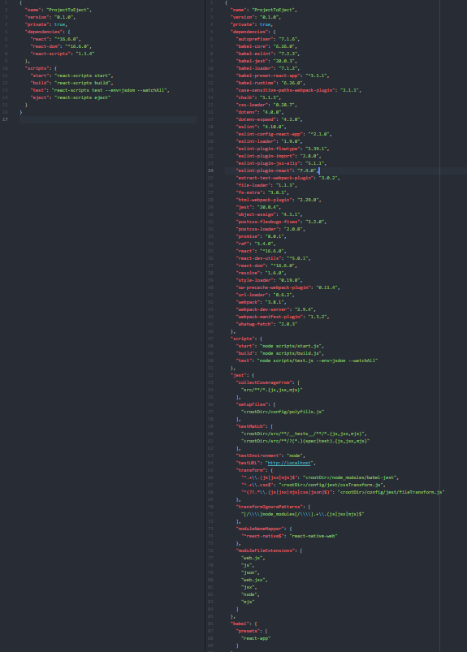
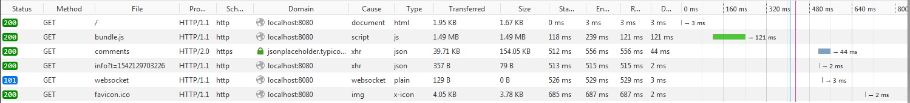
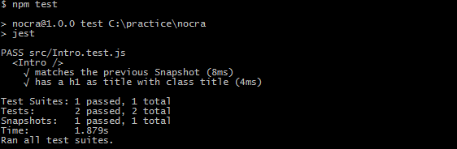
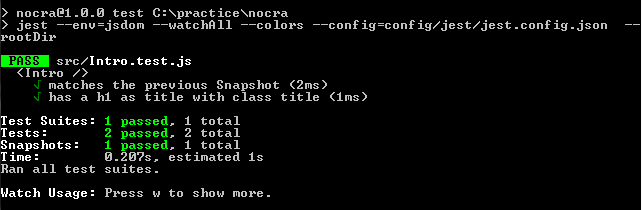
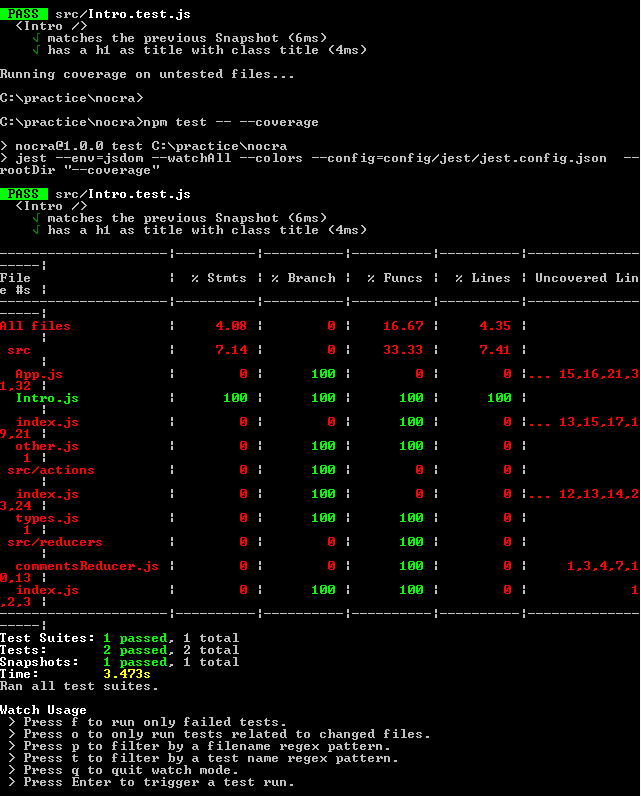
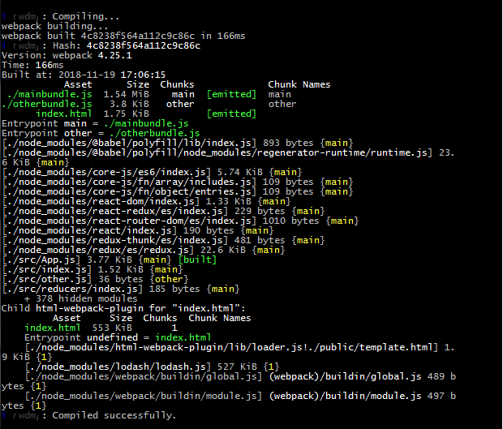
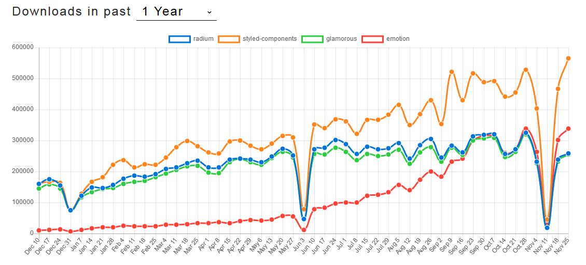
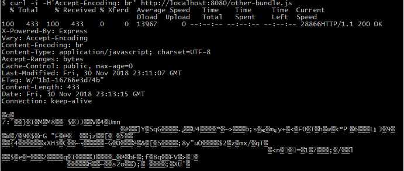
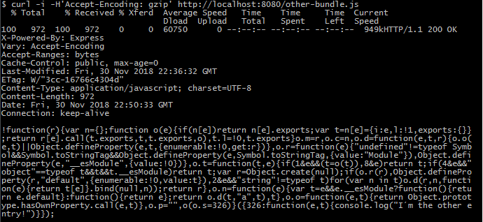
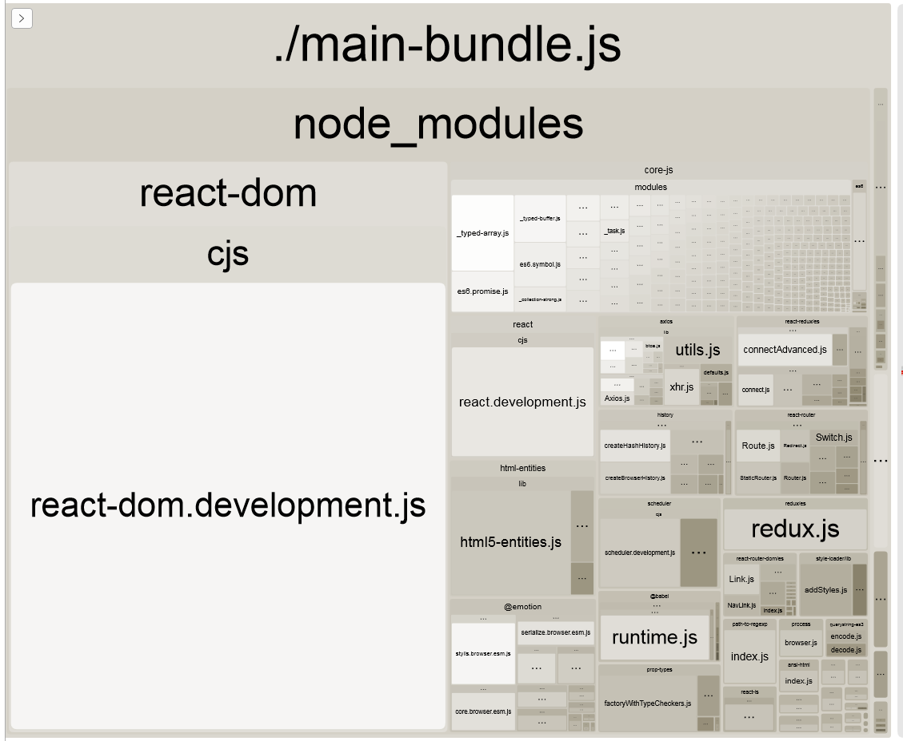

## Webpack

<!-- TODO:
What is
What´s a bundle.
Others like Webpack >  Browserify
-->

Quoting _Webpack_ documentation (which you should check regularly), "_webpack is a static module bundler for modern JavaScript applications_".
It takes all the files (let´s just care, at least for the moment, only about `\*.js`) wired up in our project and generates a bundle(s) that will be used as our "static files or assets".

As always, the best way to illustrate this statement is through a basic example.
Hands at work!

Create a new folder

```
mkdir webpack
cd webpack
```

Initiate the project (`-y` is the default flag)

```
npm init -y
```

Install `webpack` and `webpack-cli`

```
npm install --save-dev webpack webpack-cli
```

Edit your `package.json` and add the following script:

```json
  "build": "webpack --config=webpack.config.js"
```

Create the file `webpack.config.js`

```
touch webpack.config.js
```

**webpack.config.js**

```javascript
const path = require('path');

module.exports = {
  entry: {
    main: './src/index.js'
  },
  mode: 'development',
  output: {
    filename: 'bundle.js',
    path: path.resolve(__dirname, 'dist')
  }
};
```

Create the `dist` folder

```
mkdir dist
```

Inside dist create the file `index.html`

```
touch index.html
```

**index.html**

```html
<body>
    <h1>Testing Webpack...!</h1>
    <script src="bundle.js"></script>
</body>
```

Create the folder `src`

```
mkdir src
```

Inside `src` create the files `app.js`, `index.js` and `other.js`

```
touch app.js index.js other.js
```

**index.js**

```javaScript
import App, { someFunction } from './app';

console.log('index.js');

someFunction();
```

**app.js**

```javaScript
console.log('app.js');

module.exports.someFunction = () => {
  console.log('app.js > someFunction');
};
```

**other.js**

```javaScript
console.log('other.js');
```

Inside your root directory, `webpack`, run...

```
npm run build
```

You will see the following output...

```
> wp@1.0.0 build C:\webpack
> webpack --config=webpack.config.js

Hash: 78cc493c0b28897f196a
Version: webpack 4.23.1
Time: 96ms
Built at: 2018-11-01 18:14:50
    Asset      Size  Chunks             Chunk Names
bundle.js  4.55 KiB    main  [emitted]  main
Entrypoint main = bundle.js
[./src/app.js] 115 bytes {main} [built]
[./src/index.js] 91 bytes {main} [built]
```

Open your `index.html` and check the console.

Result:

```
app.js app.js:1:1
index.js index.js:6:1
app.js > someFunction app.js:4:3
```

A new static file will be hosted on your `dist/`; the file: `bundle.js`
Open that file. Among with webpack (and related dependencies) code, you will find our transpiled and "bundled code".

So...
We have a configuration file, `webpack.config.js`, where we are defining our entry point, or the file which will wire (directly or indirectly) the other ones resulting in `bundle.js`; this bundle contains the code of the entry or main file `index.js` and also `app.js` which is imported on `index.js`. However, we have the file `other.js` which was not included since it´s not part of the "cabling". As soon as we wire it up to index.js or app.js, it will be included in our bundle.

We could also add it to our entry object

webpack.config.js

```javascript
entry: {
  main: './src/index.js',
  other: './src/other.js'
},
```

In this case, we are going to remove from output the following line `filename: 'bundle.js',` since, if not, once it generates the first bundle it will try to generate the second with the existing bundle name of bundle.js

Now, after executing `npm run build` we will have 2 bundles:

```
Built at: 2018-11-02 18:30:48
   Asset      Size  Chunks             Chunk Names
 main.js  4.58 KiB    main  [emitted]  main
other.js   3.8 KiB   other  [emitted]  other
```

If you do this, remember to update your `\*.html` file

```html
<body>
    <h1>Testing Webpack...!</h1>
    <script src="main.js"></script>
    <script src="other.js"></script>
</body>
```

Alternatively, if you want to be able to keep the `filename property` and/or rename the resulting files, you can use the `[name] namespace`
Example:

```javascript
output: {
  filename: '[name]-bundle.js',
  path: path.resolve(__dirname, 'dist')
}
```

If you do this, remember to update your `index.html` with the proper naming of the `*.js` files, in our case:

* main-bundle.js
* other-bundle.js

Open `other.js` (or, other-bundle.js, or, whatever you decided to call this file).
Remember that in our webpack configuration file we set the flag development...? Well, change it to production: `mode: 'production',`.

Build the project again.

Go to `other.js`.
Yes...! Webpack is concatenating, minifying and -just- bundling the code needed for production, preserving the order of execution of our files or modules.

We can compare both builds...

On DEV mode

```
main.js  4.58 KiB    main  [emitted]  main
other.js   3.8 KiB   other  [emitted]  other
```

On PROD mode

```
main.js   1.09 KiB       0  [emitted]  main
other.js  962 bytes       1  [emitted]  other
```

All this, just adding the webpack dependency to our project and setting a few options.
Even when this configuration is probably the most basic one, you can start seeing the power and flexibility of webpack. Also, its "discernment"... Everything outside the entry points that´s not indexed as part of the project, will not be part of the output.

---

### JS Module Systems

At the beginning of the React´s Introduction, we saw how we could reuse and enhance our code through components and (forgive the redundancy) compose "as a whole" more complex units. Anew, the idea of blocks of different shapes, colors and sizes encasing with each other (in a direct or intermediate relation) comes to our attention.

This topic (JS Module Systems) is extremely close to the compositional POV: just replace components with modules and you will have a clear inaugural understanding.

Daily, we write logic (or logic plus UI). It´s not strange that, with some recurrence, if we architected our projects in the right way ("standardization") we will find ourselves reusing previous code.
During your first steps, copying and pasting code between files was something forgivable: far away from a good practice, nor an useful methodology, but, in those moments you were struggling with bigger priorities. Now, however, having a deeper understanding imagine if every time you want to consume "x-function" you manually ad its code to the particular file, and, one day, you have to update or enhance your function. Yes, global search will help you but this approach will never scale.
With this in mind, we could create a module (or package) use it, share it and re-use it. You have been doing it through React, but also, at the time of consuming `npm packages`: you import the entire package or part of it (x-function) and call it in as many places (aka, files) as necessary. And, if a new version is released, you just have to update the version of the packaging (having the possibility of anchor or lock to a particular version in case of issues related to compatibility).

At a "high-level" Module Systems are "rules" to define how we are going to "include" files in our project or application.

<!-- TODO:
Module Systems...
Differences, examples, encapsulation, dependency... revealing module pattern
-->

We have 3 main JS Module Systems: `CommonJS`, `AMD` and `ES2015 modules`.

**CommonJS**: require/exports (module.exports)
Sight: Server side development (Node´s default)
Behavior: sync > modules are loaded in the consigned order and at the particular moment (on the next example, on index.js, invert the order of the 2 first lines of code to illustrate the case). Remember, no import on-demand/async/runtime.
Result: `index.js | app.js | app.js > someFunction` Instead of: `app.js | index.js | app.js > someFunction`

Example:

index.js

```javascript
const app = require('./app.js');
console.log('index.js');

app.someFunction();
```

app.js

```javaScript
console.log('app.js');

// exports.fn is a shortcut of module.exports.fn
exports.someFunction = () => {
  console.log('app.js > someFunction');
};
```

**AMD: Async Module Definition**
Sight: Client side (browser)
Behavior: Async module loading.

Example:

index.js

```javaScript
console.log('index.js');

require(['./app'], function(someModule) {
  someModule.someFunction();
});
```

app.js

```javaScript
console.log('app.js');

define([], function() {
  return {
    someFunction: function() {
      console.log('app.js > someFunction');
    }
  };
});
```

Result: `index.js | app.js | app.js > someFunction`

**ES2015 modules** (also known as ECMAScript 6)
Sight: Standarization. Both client and server side.
Behavior: sync/async compatible.  
As we did with CommonJS invert the order of the 2 first lines of code: results don´t change since import is static and we cannot define freely where to call it.
`app.js | index.js | app.js > someFunction`

Example:

index.js

```javaScript
import * as app from './app';

console.log('index.js');

app.someFunction();
```

app.js

```javaScript
console.log('app.js');

export const someFunction = () => {
  console.log('app.js > someFunction');
};
```

---

<!--TODO:
Code spliting and how to load bundle dynamically
https://webpack.js.org/guides/code-splitting/

From Crate React App with a pre-set setup to our custom Webpack configuration
-->

<!-- TODO: Relocation of the next part -->

At this point, you should be familiar with `static imports` like `import { myFunction } from './helpers'`. However, a new async or dynamic way of importing ES modules is going to be available soon. Check [tc39 > proposal-dynamic-import
](https://github.com/tc39/proposal-dynamic-import).

Currently, we import all the required modules (at the top of our file), compile them and generate a bundle, without the possibility of loading a module on-demand (or dynamically), for example, when a user clicks on a button, when certain condition is met (like a change on a state property), etc.

Imagine if you were able to freely load modules at the runtime.

Example:

```javaScript
button.addEventListener('click', event => {
    e.preventDefault();
    import('./moreInformation.js')
    .then(moreInformation => {
        moreInformation.load();
    })
    .catch(error => {
        //...
    })
});
```

What happens behind the scenes is easy: we return a Promise that will be resolved on a certain time point, retrieving the module with its entire functionality.

---

Until now, our focus was only on the App (aka, our code)... `CRA` has been effectively in charge of the rest <!--TODO:; Extend what rest is --> A good way of having a "taste" of the big picture without compromising your current work, would be: create a new app with CRA, add one Component and eject your project: `npm run eject`

Here´s a screen capture comparing both `package.json`: before and after ejecting just to delight your own curiosity in case you decided to not eject a project.


However, the "biggest change" will be inside `config/` and `scripts/`
We are not analyzing the results of ejecting (just providing a high level illustration) but, opening the door to show you what are we going to do, which basically is, wire up what CRA was doing for us out-of-the-box.

We are going to start from scratch.
What we want...? Do what CRA does plus, add some extra functionality related to our needs. We will work with the example `examples/[basic-redux-example[redux-thunk]`.

<!-- TODO:; what CRA is doing for us... Explain --->

```
mkdir nocra
cd nocra

npm init -y
```

Time to install the dependencies that we are using in our redux-thunk example:

```
npm install --save axios lodash react react-dom react-redux react-router-dom redux redux-thunk
```

We are going to move the following folders/ and files from `examples/[basic-redux-example[redux-thunk]` to `nocra`

* public/
* src/
* .gitignore
* README.md

Now... Let´s install some dependencies:

* nodemon
* webpack
* babel-core
* babel-loader
* babel-plugin-async-to-promises
* babel-plugin-syntax-dynamic-import
* babel-plugin-transform-async-to-promises
* babel-plugin-transform-runtime
* babel-plugin-universal-import
* babel-polyfill
* babel-preset-env
* babel-preset-es2015
* babel-preset-react
* babel-preset-stage-2

```
npm install --save nodemon
```

```
npm install --save-dev webpack webpack-cli webpack-dev-server
```

```
npm install --save-dev @babel/core babel-loader babel-plugin-async-to-promises @babel/plugin-syntax-dynamic-import babel-plugin-transform-async-to-promises @babel/plugin-proposal-class-properties @babel/plugin-transform-runtime babel-plugin-universal-import @babel/polyfill @babel/preset-env @babel/preset-es2015 @babel/preset-react @babel/preset-stage-2
```

Now, in our package.json we are going to add the following script...

```
"scripts": {
  "start": "webpack-dev-server --config=config/webpack.config.js",
},
```

Create the folder `/config` at the root level and also the file `webpack.config.js`

```
mkdir config
cd config  
touch webpack.config.js
```

webpack.config.js

```javascript
const path = require('path');

module.exports = {
  entry: './src/index.js',
  mode: 'development',
  output: {
    path: path.resolve(__dirname, '../public'),
    //  publicPath: '/',
    filename: './bundle.js'
  },
  module: {
    rules: [
      {
        test: /\.js$/,
        exclude: /node_modules/,
        use: [
          {
            loader: 'babel-loader',
            options: {
              presets: ['@babel/preset-env', '@babel/react']
            }
          }
        ]
      }
    ]
  }
};
```

And create (as well) at the root level `.babelrc`

```
{
  "presets": ["@babel/preset-env", "@babel/preset-react"],
  "plugins": ["@babel/plugin-proposal-class-properties"]
}
```

Edit your public/index.html and add after your `<div id="root"></div>`

Now, let´s run our `webpack-dev-server`

```
npm start
```

The App should be rendering the list of comments. Make a change for example in `src/App.js`.
Webpack will re-compile (or re-generate) the bundle and reload our browser tab (through a `websocket` connection).

If you go to your DevConsole and open the Network tab, these request will appear:



The current size of our bundle.js is: 1.49 MB

Let´s go back to our package.json and add a build script

```
"build": "webpack --config=config/webpack.config.js"
```

Now, instead of running `npm start` execute `npm run build`.

1. We are running webpack instead of webpack-dev-server
2. bundle.js is about 1.16 MB (before, 1.49 MB). It is not excluding "dev" functionality since our config file has `mode: 'development'`
3. It will generate the bundle.js inside public/
4. You will access to static content: file:///C:/nocra/public/index.html

We will replace (on src/index.js) the route `<Route exact path="/" component={App} />` with `<App />`. We will come later and restore the routing; but, for the moment, we want to keep the focus on `Webpack`

Rename public/index.html to public/template.html

_Install_: html-webpack-plugin. It will automatically create an `index.html` (based on our template.html) and place the JS output (between `<script>`) on `public/`; in this case, `bundle.js`.

```
npm install --save-dev html-webpack-plugin
```

In your **webpack.config.js** add

```javascript
const HTMLWebpackPlugin = require('html-webpack-plugin');
```

And after `devServer`

```javascript
plugins: [
  new HTMLWebpackPlugin({
    template: './public/template.html'
  })
];
```

Before proceeding, let´s add another "entry point".

In webpack.config.js we are going to replace the value of entry with an object setting as many properties as entries we want.

```javascript
entry: {
  main: './src/index.js',
  other: './src/other.js'
},
```

And, in output, for filename property add the "[name] namespace" as we saw in our first example:

```javascript
filename: './[name]-bundle.js';
```

Now, create the file: /src/other.js

```javascript
console.log('I´m the other entry!');
```

Let´s try both:

* webpack-dev-server with npm start at http://localhost:8080/
* webpack with npm run build at file:///C:/nocra/public/index.html

Check the "outputs" or "built assets"

webpack-dev-server

```
Asset      Size  Chunks             Chunk Names
./main-bundle.js  1.49 MiB    main  [emitted]  main
./other-bundle.js   342 KiB   other  [emitted]  other
index.html  1.75 KiB          [emitted]
```

webpack

```
Asset      Size  Chunks             Chunk Names
./main-bundle.js  1.16 MiB    main  [emitted]  main
./other-bundle.js   3.8 KiB   other  [emitted]  other
index.html  1.75 KiB          [emitted]
```

BTW, if you are a fancy person and you want to see the same colorful output from `webpack-dev-server` when running `webpack`, add this property to the configuration file: **webpack.config.js**

```javascript
stats: {
  colors: true;
}
```

This new option should just be available for webpack (webpack-dev-server is doing by default). Something similar occurs for mode: webpack should take production and webpack-dev-server development.

The temptation of cloning the file and setting one for dev and other for prod could be big. But, there´s a much better way to do it and without duplicating code.

Install: webpack-merge
npm install --save-dev webpack-merge

Inside config/ create 2 new files

```
touch webpack.config.dev.js webpack.config.prod.js
```

Now, create the boilerplate for both files:

```javascript
const merge = require('webpack-merge');
const commonConfig = require('./webpack.config.js');

const config = {};

module.exports = merge(commonConfig, config);
```

_IMPORTANT_: We are going to move the `entry` property from `webpack.config.js` (aka, our main configuration file) to each file. At future, once we have multiple configuration files taking different endpoints.

In **webpack.config.dev.js** we are going to add (inside config)

```javascript
mode: 'development',
entry: {
  main: './src/index.js',
  other: './src/other.js'
},
devServer: {
  contentBase: '../public'
}
```

In **webpack.config.prod.js** we are going to add

```javascript
mode: 'production',
entry: {
  main: './src/index.js',
  other: './src/other.js'
}
```

On package.json we are going to update our scripts:

```json
"scripts": {
  "start": "webpack-dev-server --config config/webpack.config.dev.js",
  "build": "webpack --config config/webpack.config.prod.js"
},
```

And finally, on `webpack.config.js` we are going to remove (or comment)

```javascript
mode: 'development',
```

Now, run both commands (scripts) again.
Everything should be working... And it should be working as before. However, if you compare the ouput (size of the bundled files)

```
./mainbundle.js > Now: 155 KB - Before: 1.16 MiB  
./otherbundle.js > Now: 969 bytes - Before: 3.8 KiB
```

... and, if you check the files, you will see that files were optimized for production: replacing some namespaces, minifying the code...

With the pass of the time, and after adding and removing several "entry points" you could have your public/ folder full of old and un-used bundles (aka, files).
So, we are going to do the following: every time we build our project, we are going to delete ALL the files inside the dir public/ (also, if you have the folders dist/ and build/) excluding x-files. In our case, we want to preserve: `template.html`, `manifest.json` and `favicon.ico`.

Install: clean-webpack-plugin

```
npm install --save-dev clean-webpack-plugin
```

Add a couple of dummy files to your `public/`

```
touch public/hello.js public/hello.html public/hello.h public/hi.js
```

On `webpack.config.prod.js`, add...

Outside the config object

```javascript
const path = require('path');
const CleanWebpackPlugin = require('clean-webpack-plugin');

let pathsToClean = ['dist/', 'build/', 'public/'];

let cleanOptions = {
  root: path.resolve(__dirname, '../'),
  exclude: ['template.html', 'manifest.json', 'favicon.ico'],
  verbose: true,
  dry: false
};
```

Inside our `config/`

```javascript
plugins: [new CleanWebpackPlugin(pathsToClean, cleanOptions)];
```

And execute: `npm run build`
_Note: It could take some time._

The output will start with...

```
clean-webpack-plugin: C:\practice\nocra\dist has been removed.
clean-webpack-plugin: C:\practice\nocra\build has been removed.
clean-webpack-plugin: C:\practice\nocra\public has been removed.
clean-webpack-plugin: 3 file(s) excluded - favicon.ico, manifest.json, template.html
```

And as you can see, all the dummy files were removed. Also, our bundles (\*.js) which were deleted (by clean-webpack-plugin) and re-generated (by webpack).

Let´s continue installing dependencies. Testing time:

* jest
* enzyme
* enzyme-adapter-react-16
* enzyme-to-json
* babel-jest
* identity-obj-proxy
* react-test-renderer
* regenerator-runtime
* jest-cli

```
npm install --save-dev jest enzyme enzyme-adapter-react-16 enzyme-to-json babel-jest identity-obj-proxy react-test-renderer regenerator-runtime jest-cli
```

Create `src/tempPolyfills.js`

```javascript
const requestAnimationFrame = (global.requestAnimationFrame = callback => {
  setTimeout(callback, 0);
});
export default requestAnimationFrame;
```

Create `src/setupTests.js`

```javascript
import requestAnimationFrame from './tempPolyfills';

import { configure } from 'enzyme';

import Adapter from 'enzyme-adapter-react-16';
configure({ adapter: new Adapter(), disableLifecycleMethods: true });
```

_Note_: We saw some of these configurations on `unit-tests` section. However, here, we will wire up the minimum just as proof of concept.

Then, in package.json we will add a new script...

```json
"test": "jest"
```

... and also, `jest` configuration...

```json
"jest": {
  "collectCoverageFrom": ["src/**/*.{js,jsx,mjs}", "!**/node_modules/**"],
  "moduleNameMapper": {
    "\\.css$": "identity-obj-proxy"
  },
  "transform": {
    "^.+\\.(js|jsx|mjs)$": "<rootDir>/node_modules/babel-jest"
  },
  "coverageReporters": ["text-summary"],
  "setupFiles": ["<rootDir>/src/setupTests.js"]
}
```

Create a simple component (we don´t care about testing in this particular moment, if not, Jest and Enzyme functionalities)

src/Intro.js

```javascript
import React, { Component } from 'react';

const Intro = () => {
  return <div>Intro</div>;
};

export default Intro;
```

... and its Unit Test: src/Intro.test.js

```javascript
import React from 'react';
import ReactDOM from 'react-dom';
import Intro from './Intro';

it('renders without crashing', () => {
  const div = document.createElement('div');
  ReactDOM.render(<Intro />, div);
});
```

This is the basic test that `CRA` generates for the main component.

Execute the test script: `npm run test`

And you will receive the following error:

```
> nocra@1.0.0 test C:\practice\nocra
> jest

FAIL src/Intro.test.js
  ● Test suite failed to run

    Cannot find module 'babel-core'

      at _load_babelCore (node_modules/babel-jest/build/index.js:32:24)

Test Suites: 1 failed, 1 total
Tests:       0 total
Snapshots:   0 total
Time:        1.246s
Ran all test suites.
npm ERR! code ELIFECYCLE
npm ERR! errno 1
npm ERR! nocra@1.0.0 test: `jest`
npm ERR! Exit status 1
npm ERR!
npm ERR! Failed at the nocra@1.0.0 test script.
npm ERR! This is probably not a problem with npm. There is likely additional logging output above.
```

If you are thinking... But... We have babel-core installed... Check again your package.json.
We have `@babel/core`: https://www.npmjs.com/package/@babel/core
And jest is requiring `babel-core`: https://www.npmjs.com/package/babel-core

Execute the following command to dispel any doubt:

```
npm ls babel-core
```

Result:

```
nocra@1.0.0 C:\nocra
`-- jest@23.6.0
  `-- jest-cli@23.6.0
    `-- jest-runtime@23.6.0
      `-- babel-core@6.26.3
```

Add to your `package.json`, after `@babel/core`

```json
"babel-core": "7.0.0-bridge.0"
```

Then, run: `npm install`

Now, run again the test script: `npm run test`

Result:

```
> nocra@1.0.0 test C:\practice\nocra
> jest

PASS src/Intro.test.js
  √ renders without crashing (13ms)

Test Suites: 1 passed, 1 total
Tests:       1 passed, 1 total
Snapshots:   0 total
Time:        1.9s
```

Now, let´s reformat our UT with Enzyme: Intro.test.js

```javascript
import React from 'react';
import ReactDOM from 'react-dom';
import { shallow } from 'enzyme';
import Intro from './Intro';

describe('<Intro />', () => {
  const wrapper = shallow(<Intro />);

  it('matches the previous Snapshot', () => {
    expect(wrapper).toMatchSnapshot();
  });
  it('has a h1 as title with class title', () => {
    expect(wrapper.find('h1').exists()).toBe(true);
  });
});
```

Execute the tests: `npm run test`

Result:

```
> nocra@1.0.0 test C:\practice\nocra
> jest

FAIL src/Intro.test.js
  <Intro />
    √ matches the previous Snapshot (7ms)
    × has a h1 as title with class title (9ms)

  ● <Intro /> › has a h1 as title with class title

    expect(received).toBe(expected) // Object.is equality

    Expected: true
    Received: false

      22 |   });
      23 |   it('has a h1 as title with class title', () => {
    > 24 |     expect(wrapper.find('h1').exists()).toBe(true);
         |                                         ^
      25 |   });
      26 | });
      27 |

      at Object.toBe (src/Intro.test.js:24:41)

Test Suites: 1 failed, 1 total
Tests:       1 failed, 1 passed, 2 total
Snapshots:   1 passed, 1 total
Time:        1.842s, estimated 2s
```

One of our tests is failing. Add the following to `Intro.js`

```html
<h1>Hello</h1>
```

Run the test script again...

Result:

```
× matches the previous Snapshot (16ms)
√ has a h1 as title with class title (4ms)
```

Time to refactor.
First, inside `config` we are going to create a new folder: `config/jest`.
Move the following files inside config/jest

* `src\setupTests.js`
* `src\tempPolyfills.js`

And inside our main package.json, replace...

```json
"setupFiles": ["<rootDir>/src/setupTests.js"]
```

with...

```json
"setupFiles": ["<rootDir>/config/jest/setupTests.js"]
```

Execute `npm test` or `npm run test`

We should see the same as before:


Create the file `config/jest/jest.config.json`

```
touch config/jest/jest.config.json
```

Also, we are going to move the jest´s configuration that we have in `src/package.json` to `config/jest/jest.config.json`.

```json
{
  "verbose": true,
  "collectCoverageFrom": [
    "<rootDir>/src/**/*.{js,jsx,mjs}",
    "!**/node_modules/**"
  ],
  "moduleNameMapper": {
    "\\.css$": "identity-obj-proxy"
  },
  "transform": {
    "^.+\\.(js|jsx|mjs)$": "<rootDir>/node_modules/babel-jest"
  },
  "setupFiles": ["<rootDir>/config/jest/setupTests.js"]
}
```

_Notes_:
We are...

1. Removing the `jest` property.
2. Changing the first element of the array-value of `collectCoverageFrom`
3. Adding the `verbose` property.
4. Removing `"coverageReporters": ["text-summary"]`

Inside our package.json we are going to change our test script (currently, `"test": "jest"`)

```json
"test": "jest --env=jsdom --watchAll --colors --config=config/jest/jest.config.json  --rootDir",
```

Quick comment: `--rootDir` flag will point to `.`

Now, we can try (first)

**npm test**



... then...

**npm test -- --coverage**



This will show you a table with the "testing coverage" of your tests.

Note: If you are under Windows OS, use the CMD or PowerShell to avoid any kind of issue.

<!-- TODO: Add Jest and Enzyme and wire them up... Make the watch and input possible, ect -->

<!-- TODO: Loaders for HTML and images -->

<!-- TODO:  Ver si necesito @babel/plugin-transform-arrow-functions: probar en viejo IE -->

Our app works properly in Chrome and Firefox, but... If you try IE, you will see a blank page, and, if you go to the console, the following error will grab your attention:

```
var promise = Promise.resolve(config);
'Promise' is undefined
this.interceptors.request.forEach(function unshiftRequestInterceptors(interceptor) {
```

**How we fix this...?**

1. We have installed the plugin to transpile promises: `babel-plugin-async-to-promises`
2. We have installed `babel-polyfill` to make IE "understand promises"
3. We also have installed `@babel/preset-env`

So, in our main file (or top entry point) we are going to add
src/index.js

```javascript
import '@babel/polyfill';
```

And inside our package.json

```json
  "browserslist": ["last 1 version", "> 1%", "IE 11", "IE 10", "IE 9"]
```

Refresh your browser... Great! Now we even support IE9!

<!-- TODO: Better title and intro -->

### Server Part

Let´s create the folder server

```
mkdir server && cd server
```

Init the server project and install express (plus body-parser)

```
npm init - y
npm install express body-parser
```

Create the main server file: `sever/index.js`

```javascript
const express = require('express');

const bodyParser = require('body-parser');

class RouterAndMiddlewares {
  constructor() {
    this.app = express();
    this.initExpress();
    this.middlewaresExpress();
    this.initControllers();
    this.start();
  }

  initExpress() {
    this.app.set('port', 8080);
  }

  middlewaresExpress() {
    this.app.use(bodyParser.urlencoded({ extended: true }));
    this.app.use(bodyParser.json());
  }

  initControllers() {
    require('./BasicController.js')(this.app);
  }
  start() {
    let self = this;
    this.app.listen(this.app.get('port'), () => {
      console.log(`Server Listening for port: ${self.app.get('port')}`);
    });
  }
}

new RouterAndMiddlewares();
```

Create file `server/BasicController.js`

```

```

In our main package.json, src/package.json add a new script:

```
"dev": "node src/server/index.js"
```

We are going to install the following middle-wares:

<!--TODO explain why -->

src/

1. webpack-dev-middleware
2. webpack-hot-middleware

server/

```
npm install webpack-dev-middleware webpack-hot-middleware --save-dev
```

Now, we are going to wire up webpack, these middle-wares and the express.static built-in middleware function in Express which will tell Express from where we want to serve our static content.

`server/index.js` with new changes

```javascript
const express = require('express');

const bodyParser = require('body-parser');

const webpack = require('webpack');
const config = require('../config/webpack.config.dev.js');
const compiler = webpack(config);

const webpackDevMiddleware = require('webpack-dev-middleware')(
  compiler,
  config.devServer
);

const webpackHotMiddlware = require('webpack-hot-middleware')(
  compiler,
  config.devServer
);

class RouterAndMiddlewares {
  constructor() {
    this.app = express();
    this.initExpress();
    this.middlewaresExpress();
    this.initControllers();
    this.start();
  }

  initExpress() {
    this.app.set('port', 8080);
  }

  middlewaresExpress() {
    this.app.use(bodyParser.urlencoded({ extended: true }));
    this.app.use(bodyParser.json());

    this.app.use(webpackDevMiddleware);
    this.app.use(webpackHotMiddlware);

    const staticMiddleware = express.static('public');
    this.app.use(staticMiddleware);
  }

  initControllers() {
    require('./BasicController.js')(this.app);
  }
  start() {
    let self = this;
    this.app.listen(this.app.get('port'), () => {
      console.log(`Server Listening for port: ${self.app.get('port')}`);
    });
  }
}

new RouterAndMiddlewares();
```

Execute `npm run dev` and go to http://localhost:8080/

If we make a change, for example, in src/App.js we modify the h1 text, webpack will re-compile...



However, we lost the socket connection and in consequence, the "hot reloading feature". Every time that you make a change, YOU have to reload the browser-tab manually.
This is ok, but, impractical. So, let´s add hot-reloading through `webpack-hot-middleware`

In webpack.config.dev.js add at the top (aka, require webpack)

```javascript
const webpack = require('webpack');
```

Then add to the devServer property:

```javascript
devServer: {
  contentBase: '/..public',
  hot: true,
  overlay: true
},
```

Then add plugins:

```javascript
plugins: [new webpack.HotModuleReplacementPlugin()];
```

Next, in our main client file, in our case **src/index.js** add at the top:

```javascript
require('webpack-hot-middleware/client?reload=true');
```

Run: `npm run dev`

You will see in the browser´s console:

```
[HMR] connected | client.js:88:22
[HMR] Checking for updates on the server... | process-update.js:39:22
```

Make a change, for example, on the text of the H1 tag that we have in `src/App.js`

Now, you will see in the browser´s console:

```
[HMR] bundle rebuilding | client.js:230:9
[HMR] bundle rebuilt in 242ms | client.js:238:9
[HMR] Checking for updates on the server... | process-update.js:39:22
```

And see, as well, your changes on screen.

<!--
This works well as proof ocf concept. However, if you try to execute `npm run build` and load your built project you will see the following errors and a white page:

```
Firefox can’t establish a connection to the server at file:///__webpack_hmr. main-bundle.js:6:22162
Error: [HMR] Hot Module Replacement is disabled. main-bundle.js:6:35349
Firefox can’t establish a connection to the server at file:///__webpack_hmr. main-bundle.js:6:22162
```

To fix this, we are going to REMOVE `require('webpack-hot-middleware/client?reload=true');` from `src/index.js` and overwrite our main entry point in `webpack.config.dev.js`

```javascript
entry: {
  main: ['webpack-hot-middleware/client?reload=true', './src/index.js']
},
```

Now, everything should be working properly.
-->

We didn´t deal with `CSS` yet. So, create the file `src/App.css`

```css
h1 {
  font-size: 20px;
}
```

And then, import it into src/App.js

```javascript
import './App.css';
```

You should see the following error (in both, console and screen and in your Node console if you are building your project with `npm run build`).


The message is pretty clear: webpack needs the proper loader to process other files than \*.js.
Let´s install:

* style loader
* css-loader

```
npm install --save-dev css-loader style-loader
```

And, in `webpack.config.js` add a new rule:

```javascript
{
  test: /\.css$/,
  use: [
    { loader: 'style-loader' },
    {
      loader: 'css-loader',
      query: {
        modules: true,
        localIdentName: '[name]__[local]__[hash:base64:5]'
      }
    }
  ]
}
```

Note: `modules: true` enables `CSS modules` while `localIdentName` configures the generated ident (example: `App__rPi__3Noxh`; the hash "3Noxh", will be particular useful for caching purposes once we are in a `prod env`)

Go to http://localhost:8080/ and you should see everything working as expected.

Create a new css file, `src/index.css` with any rule you want and import it into `src/index.js`

_Short explanation:_ When `css-loader` grabs all the local-imported \*.css files (like App.css, index.css) `style-loader` add those rules within `<style>`.
Remember that webpack executes from right to left.

In our example, if you inspect the markup you should see...

```html
<style type="text/css">h1 {
  font-size: 20px;
}
</style>
<style type="text/css">div {
  margin: 20px;
}
</style>
```

One rule is coming from `src/App.css`, the other from `src/index.css`.

We can (also) start using `in-line styling`, `CSS modules` and/or `CSS in JS`

`in-line styling` example:

```javascript
<h1 style={{ textDecoration: 'underline' }}>List of comments 101</h1>
```

`CSS modules` example:

In `src/App.css` add the rule

```
.rPi {
  border: 1px solid black;
}
```

Then in `src/App.js`

* Import all the styles: `import styles from './App.css';`
* Apply the style to the particular element: ``

`CSS in JS` example:

Create the file `src/App.css.js`

```javascript
const settings = {
  color: 'white'
};

const sectionTitle = {
  color: settings.color,
  backgroundColor: 'grey',
  padding: '20px'
};

export default { sectionTitle };
```

Then in `src/App.js` we are going to add the following variable

* Import: `import cssInJs from './App.css.js';`
* Add the style tag: `<h1 style={cssInJs.sectionTitle}>List of comments 101</h1>`

There´re several CSS-in-JS libraries. Here is a graph showing the "trends" between 2017/2018 in relation to 4 of those dependencies.



For more information: https://www.npmtrends.com/radium-vs-styled-components-vs-glamorous-vs-emotion

Note: [npm trends](https://www.npmtrends.com/) is a pretty useful tool to compare "npm package´s popularity" on a certain period of time.

We are going to try [emotion](https://github.com/emotion-js/emotion)

* @emotion/core
* @emotion/styled
* babel-plugin-emotion: Babel plug-in for the minification and optimization of emotion styles. It is not mandatory but recommended.

```
npm install --save @emotion/core @emotion/styled
npm install --save-dev babel-plugin-emotion
```

And we are going to add `emotion` plugin to `.babelrc` with some basic configuration:

```
["emotion", { "sourceMap": true, "autoLabel": true }]
```

In `src/App.js`

1. Import: import styled from '@emotion/styled';
2. Create the emotion Component:

```javascript
const CommentsBox = styled('div')`
  background-color: lavender;
`;
```

3. Replace (div) `<div>{this.renderComments()}</div>` with `<CommentsBox>{this.renderComments()}</CommentsBox>`

<!-- TODO check and add more examples...
https://emotion.sh/docs/migrating-to-emotion-10
https://codesandbox.io/s/pk1qjqpw67
https://emotion.sh/docs/styled

Also add example with css``
-->

Time for handling images.
Let´s create a new dir `srcimages/` and add any image. In my case, `rPI-400x400.jpg`.
Now, let´s import that image in our `src/App.js`

```javascript
import rPI from '.images/rPI-400x400.jpg';
```

We receive an error similar to the previous one:

```html
ERROR in ./srcimages/rPI-400x400.jpg 1:0 Module parse failed: Unexpected character '�' (1:0) You may need an appropriate loader to handle this file type. (Source code omitted for this binary file)
```

And yes, it ´s indeed related to a missing loader.

For this, we are going to install file-loader

```
npm install --save-dev file-loader
```

And add the proper rule inside `webpack.config.js`

```javascript
{
  test: /\.jpg$/,
  use: [
    {
      loader: 'file-loader',
      options: {
        name: 'images/[name].[ext]'
      }
    }
  ]
}
```

If you want to support multiple file ext (or types) you can use:

```javascript
test: /\.(png|jpg|gif)$/,
```

It should work properly, but... We are not rendering the image.
Add to `src/App.js`.

```javascript

```

**Congratulations!** You can check another important topic in your list of TODO!

---

At the moment, in our `package.json` we have the following scripts

```json
"test": "jest --env=jsdom --watchAll --colors --config=config/jest/jest.config.json  --rootDir",
"dev": "node server/index.js",
"start": "webpack-dev-server --config config/webpack.config.dev.js",
"build": "webpack --config config/webpack.config.prod.js"
```

We are going to add a new one, prod, setting production as "environment variable" and executing (aka, running) our server file...

```
"prod": "NODE_ENV=production node server/index.js"
```

Also, we are going to add `NODE_ENV=production` to our build script.

```
"build": "NODE_ENV=production webpack --config config/webpack.config.prod.js"
```

The ending result should be:

```json
"test": "jest --env=jsdom --watchAll --colors --config=config/jest/jest.config.json  --rootDir",
"start": "webpack-dev-server --config config/webpack.config.dev.js",
"dev": "node server/index.js",
"prod": "NODE_ENV=production node server/index.js",
"build": "NODE_ENV=production webpack --config config/webpack.config.prod.js"
```

Now, before testing the scripts, add the following in `server/index.js`

```javascript
const isProd = process.env.NODE_ENV === 'production';
```

And wrap everything that we don´t need in `production` inside the condition: `!isProd`. Also, declare the variables outside the if statement:

```javascript
let webpackDevMiddleware, webpackHotMiddlware;
if (!isProd) {
  ...
  webpackDevMiddleware = require('webpack-dev-middleware')(
    compiler,
    config.devServer
  );
  ...
}
```

In case of doubts, check: `server/index.js`

Time to test our `scripts`!

1. `npm test` >> OK
2. `npm start` >> OK
3. `npm run dev` >> OK
4. `npm run prod` >> ERROR: 'NODE_ENV' is not recognized as an internal or external command (\* If you are under Windows OS)

If this is your case, you can adapt the script to set the variable in the "Windows´way" (something like: `SET NODE_ENV=production & node server/index.js`), however, we want to be as agnostic as we can avoiding particular "blocks of code" for x-OSs.

So... As you can imagine, we are going to install a new package: cross-env

```
npm install --save-dev cross-env
```

Once this is done, we are going to precede the commands of the prod and build scripts with cross-env

```json
"prod": "cross-env NODE_ENV=production node server/index.js",
"build":
  "cross-env NODE_ENV=production webpack --config config/webpack.config.prod.js"
```

Run again: `npm run prod` >> OK

5. `npm run build` >> OK

Now... Let´s check that "hot reload" functionality (libraries and code) are just included in "test environments".

1. `npm start` >> Works, however, you will see in your browser console, example: `Firefox can’t establish a connection to the server at http://localhost:8080/__webpack_hmr.` Remember that we are not running the server (node + express >> node server/index.js) if not the client (webpack-dev-server --config config/webpack.config.dev.js).

So, first, rename `webpack.config.dev.js` to `webpack.config.dev.server.js`

Then, create a new file at the same level: `webpack.config.dev.client.js`

<!--
```javascript
const webpack = require('webpack');
const merge = require('webpack-merge');
const commonConfig = require('./webpack.config.js');

const config = {
  mode: 'development',
  entry: {
    main: ['./src/index.js']
  },
  devServer: {
    contentBase: '/..public',
    overlay: true
  }
};

module.exports = merge(commonConfig, config);
```
-->

```javascript
const webpack = require('webpack');
const merge = require('webpack-merge');
const commonConfig = require('./webpack.config.js');

const BundleAnalyzerPlugin = require('webpack-bundle-analyzer')
  .BundleAnalyzerPlugin;

const config = {
  mode: 'development',
  entry: {
    main: ['webpack-hot-middleware/client?reload=true', './src/index.js'],
    other: './src/other.js'
  },
  devServer: {
    contentBase: '/..public',
    hot: true,
    overlay: true
  },
  plugins: [
    new webpack.HotModuleReplacementPlugin(),
    new BundleAnalyzerPlugin({
      generateStatsFile: true
    })
  ]
};

module.exports = merge(commonConfig, config);
```

And, replace the scripts:

```json
"start": "webpack-dev-server --config config/webpack.config.dev.client.js",
"build:dev": "webpack --config config/webpack.config.dev.client.js",
```

And, inside `server/index.js`, `webpack.config.dev.js` with `webpack.config.dev.server.js`

Try again: `npm start`. Voilà! Congratulations!

2. `npm run dev` >> OK
3. `npm run prod` >> OK (Remember that in prod you don´t have the hot reloader feature)
4. `npm run build` >> OK
5. `npm run build:dev` >> OK

Previously, in our "basic example" we compared prod and dev outputs in relation to the mode property value (on our webpack config file).
We are going to do the same for this project:

Dev:

* ./main-bundle.js 1.64 MiB
* ./other-bundle.js 3.8 KiB
* images/rPI-400x400.jpg 17.9 KiB
* index.html 1.76 KiB

Prod:

* ./main-bundle.js 259 KiB
* ./other-bundle.js 971 bytes
* images/rPI-400x400.jpg 17.9 KiB
* index.html 1.76 KiB

Great! Even when `main-bundle.js` is much smaller in PROD, it will be flagged as big and you will see the following WARNING:

```
WARNING in asset size limit: The following asset(s) exceed the recommended size limit (244 KiB).
This can impact web performance.
Assets:
  ./main-bundle.js (259 KiB)

WARNING in entrypoint size limit: The following entrypoint(s) combined asset size exceeds the recommended limit (244 KiB). This can impact web performance.
Entrypoints:
  main (259 KiB)
      ./main-bundle.js


WARNING in webpack performance recommendations:
You can limit the size of your bundles by using import() or require.ensure to lazy load some parts of your application.
For more info visit https://webpack.js.org/guides/code-splitting/
```

Don´t worry about this for the moment... Soon we will fix it, but, before addressing this point, we are going to return to how we are handling styles.
Now, all our styles are part of our header:

```html
<style type="text/css">h1 {
  font-size: 20px;
}

.App__rPi__3Noxh {
  border: 1px solid black;
}
</style>

<style type="text/css">body {
  margin: 30px;
}
</style>

<style data-emotion="css">.css-1m4dovs-CommentsBox{background-color:lavender;}</style>
```

What we want...? To have a separate "CSS file per JS file which contains CSS".
Yes, another dependency: `mini-css-extract-plugin`

```
npm install --save-dev mini-css-extract-plugin
```

We are going to use this library JUST in production.

So, go to `webpack.config.prod.js` and import the dependency `const MiniCssExtractPlugin = require("mini-css-extract-plugin");`.

Inside the config object add:

```javascript
module: {
  rules: [
    {
      test: /\.css$/,
      use: [MiniCssExtractPlugin.loader, 'css-loader']
    }
  ]
},
```

And include it in the plugins array:

```javascript
new MiniCssExtractPlugin({
  filename: '[name]-[contenthash].css'
});
```

Great! Now we have to refactor our `webpack config` files...

In `webpack.config.js` remove or comment:

```javascript
{
  test: /\.css$/,
  use: [
    { loader: 'style-loader' },
    {
      loader: 'css-loader',
      query: {
        modules: true,
        localIdentName: '[name]__[local]__[hash:base64:5]'
      }
    }
  ]
},
```

And inside the `config` object in both, `webpack.config.dev.client.js` and `webpack.config.dev.server.js`, add:

```javascript
module: {
  rules: [
    {
      test: /\.css$/,
      use: [
        { loader: 'style-loader' },
        {
          loader: 'css-loader',
          query: {
            modules: true,
            localIdentName: '[name]__[local]__[hash:base64:5]'
          }
        }
      ]
    }
  ]
},
```

Try `npm start`. Everything should be working and the styles will be in the header.
Try `npm run build`. You will see that we have a new \*.css file included in our header. Example: `<link href="main-50be1c23bed016f8c72b.css" rel="stylesheet">` If you open the file, you will find the styles of both files: `src/App.css` and `src/index.css`.

This works well, however... We are duplicating code. We can fix this going back and doing the following...
Remove what we add in both, `webpack.config.dev.client.js` and `webpack.config.dev.server.js` (module > rules > .css)

In `webpack.config.prod.js` remove:

```javascript
module: {
  rules: [
    {
      test: /\.css$/,
      use: [MiniCssExtractPlugin.loader, 'css-loader']
    }
  ]
},
```

And, inside `webpack.config.js`:

Import MiniCssExtractPlugin: `const MiniCssExtractPlugin = require('mini-css-extract-plugin');`
Declare a variable and initialize it with the result of checking if we are in prod env.
`const isProd = process.env.NODE_ENV === 'production';`

We are going to add other 2 variables with the configuration for `dev` and `prod`:

```javascript
const cssForDev = [
  { loader: 'style-loader' },
  {
    loader: 'css-loader',
    query: {
      modules: true,
      localIdentName: '[name]__[local]__[hash:base64:5]'
    }
  }
];

const cssForProd = [MiniCssExtractPlugin.loader, 'css-loader'];
```

And, finally, we are going to replace the rule for `\.css` with:

```javascript
{
  test: /\.css$/,
  use: isProd ? cssForProd : cssForDev
},
```

Let´s test that everything is behaving properly:

* `npm star`
* `npm run build`

Congratulations! But (and yes, always is a but) our `css outpout` is not optimized for a `prod env` (at least, we would want to minimize the code)
If you open the \*.css file, you will see:

```css
h1 {
  font-size: 20px;
}

.rPi {
  border: 1px solid black;
}

body {
  margin: 30px;
}
```

Install: optimize-css-assets-webpack-plugin

```
npm install --save-dev optimize-css-assets-webpack-plugin
```

In `webpack.config.prod.js` import it and add it as a plugin with the default configuration:

```javascript
const OptimizeCssAssetsPlugin = require('optimize-css-assets-webpack-plugin');

...
...
...

new OptimizeCssAssetsPlugin({
  assetNameRegExp: /\.css$/g,
  cssProcessor: require('cssnano'),
  cssProcessorOptions: { discardComments: { removeAll: true } },
  canPrint: true
});
```

Now, execute: `npm run build`
Open the resulting \*.css
`h1{font-size:20px}.rPi{border:1px solid #000}body{margin:30px}`

webpack is minifying the resulting \*.js files for us when we execute: `npm run build`
Nevertheless we are going to use `uglify-js` to improve the minification. Install: `uglifyjs-webpack-plugin`

```
npm install uglifyjs-webpack-plugin --save-dev
```

And in `webpack.config.prod.js`

1. Import it: `const UglifyJsPlugin = require('uglifyjs-webpack-plugin');`
2. Add it to our configuration object:

```javascript
optimization: {
  minimizer: [new UglifyJsPlugin()]
},
```

In our example we will go from 253 KiB to 252 KiB. Remember... Everything counts!

---

We are minifying and uglifying our CSS and JS. Now, let´s think about compression.

Why Brotli...?
For 5 paragraphs of lorem ipsum, Brotli beats gzip by 5%. If I run the same experiment with the front page of reddit.com from 10/01/2015, Brotli beats gzip by 22%! Note that both measurements were using the compressors out of the box without any tweaking of configuration values.

Whether or not a significant portion of your userbase is using a browser that supports Brotli as a content encoding, whether the added latency and memory costs are worth it, and whether your HTTPS server or CDN support Brotli is another story. But if you’re looking for better than gzip performance, Brotli looks like a possible contender.
More info: https://hacks.mozilla.org/2015/11/better-than-gzip-compression-with-brotli/

Install: brotli-webpack-plugin

```
npm install --save-dev brotli-webpack-plugin
```

In webpack.config.prod.js we are going to...

1. Import it: `const BrotliPlugin = require('brotli-webpack-plugin');`
2. Add it to our plugins: `new BrotliPlugin()`

Now, we are going to install express-static-gzip to server compressed files from our server.

```
npm install express-static-gzip
```

Then, in server/index.js we are going to...

1. Import it: const expressStaticGzip = require('express-static-gzip');
2. Inside middlewaresExpress() method we are going to replace...

```javascript
const staticMiddleware = express.static('public');
this.app.use(staticMiddleware);
```

with this...

```javascript
this.app.use(
  expressStaticGzip('public', {
    enableBrotli: true,
    prefere: ['br']
  })
);
```

We can also add `gzip`
Install: compression-webpack-plugin

```
 npm install compression-webpack-plugin --save-dev
```

In webpack.config.prod.js we are going to...

1. Import it: `const CompressionPlugin = require('compression-webpack-plugin');`
2. Add it to our plugins:

```javascript
new CompressionPlugin({
  algorithm: 'gzip'
}),
```

Time to test it!
First, we need to create all the compressed files (\*.br and \*.gz). For this, we have to execute `npm run build`.
In your public folder you should see all these new files. BTW, the \*.css is so small that it is not going to be compressed.
Now, execute `npm run prod` and do a `curl -i -H'Accept-Encoding: br' http://localhost:8080/other-bundle.js`

Result:


Great! Everything is working!
Comment `expressStaticGzip()` and uncomment `express.static()` to test the case without compression... And do again a `curl -i -H'Accept-Encoding: br' http://localhost:8080/other-bundle.js`

Result:


---

We have a "clear view" of what we want for `dev` and what for `prod`. However, we need to find a way to communicate to other libraries or dependencies which is the environment where we are. For this, we will use the plugin `DefinePlugin`.

First, import `webpack` in `webpack.config.js`

```javascript
const webpack = require('webpack');
```

Also, in `webpack.config.js` add the plugin:

```javascript
new webpack.DefinePlugin({
  'process.env.NODE_ENV': JSON.stringify(process.env.NODE_ENV)
});
```

... and `console.log('Environment', process.env.NODE_ENV);`
(You can log from other \*.js files, example: `src/App.js`. In this case, you will see the output in your browser console)

Then, remove `const webpack = require('webpack');` from `webpack.config.dev.client.js`.

If you try `npm run build` you will see the proper output: `Environment production`
However, `npm start`, `npm run dev`, `npm run build:dev` will show: `Environment undefined`.

We are going to set the global variable (environment variable) `NODE_ENV` in our scripts as we did it for `npm run build`
For the following scripts: `npm start`, `npm run dev`, `npm run build:dev` add `cross-env NODE_ENV=development`.

---

If you open, for example, `main-bundle.js` (one of webpack´s output) you will see that we have both: `vendor` (or third party) code and our `application code`. To make this "human-readable" or "human-visible" we can install `webpack-bundle-analyzer` which allows us to "visualize size of webpack output files with an interactive zoomable treemap".

```
npm install --save-dev webpack-bundle-analyzer
```

In `webpack.config.dev.server.js`

1. Import it: `const BundleAnalyzerPlugin = require('webpack-bundle-analyzer').BundleAnalyzerPlugin;`
2. Add it to the plugins section: `new BundleAnalyzerPlugin()`

Now, execute: `npm run dev`
Go to http://127.0.0.1:8888/

Result:


<!--TODO check more flags
https://www.npmjs.com/package/webpack-bundle-analyzer
-->

We are going to use `SplitChunksPlugin`

Before, let´s check the size of our `main-bundle.js`

```
npm run build
```

Result:

```
./main-bundle.js    252 KiB  
```

In `webpack.config.js` add a new property:

```javascript
optimization: {
  splitChunks: {
    chunks: 'all',
    cacheGroups: {
      vendor: {
        filename: '[name].bundle.js'
        chunks: 'initial',
        minChunks: 2
      }
    }
  }
}
```

Now we will have:

```
./main-bundle.js   4.93 KiB
./vendors~main-bundle.js    248 KiB
```

You can generate the dev version (with all the dev added functionality) executing:

```
npm run build:dev
```

Result:

```
./main-bundle.js  27.5 KiB
./vendors~main-bundle.js  1.61 MiB
```

Great! Everything is working properly and now, we have our code separated from vendor´s.

---

---

##From a Client Side Rendering (Traditional React App) to Server Side rendering

At the moment, we have the following scripts

```
"test": "jest --env=jsdom --watchAll --colors --config=config/jest/jest.config.json  --rootDir",
"start": "cross-env NODE_ENV=development webpack-dev-server --config config/webpack.config.dev.client.js",
"dev": "cross-env NODE_ENV=development node server/index.js",
"prod": "cross-env NODE_ENV=production node server/index.js",
"build:dev": "cross-env NODE_ENV=development webpack --config config/webpack.config.dev.client.js",
"build": "cross-env NODE_ENV=production webpack --config config/webpack.config.prod.js"
```

From these, we have two (dev and prod) that start a `basic express server` (these scripts need first to generate the assets through `npm run build:dev` or `npm run build`). _Remember_: first we build, then we serve.

This works great for a `static site` or a "traditional client side React App (CRA)", but, if you need to have "dynamic control" over the markup or HTML (not the built resources like \*.css or \*.js) you will need a "render server" which basically, will take "data" and produce HTML that will be sent to the client across the express server.
It can sound somewhat confusing, however, once we go through the proper steps and examples it will turn more clear.

Before diving into SSR, I want to make a change to preserve the HTML build functionality in case I need it later (always keep doors open).
Now, we are using `HTMLWebpackPlugin`, passing an HTML template and generating (via this plugin) our HTML document, `index.html`, the one that we serve as root access point of our `static site`.
As we said, we are going to delegate the creation and rendering of the markup (HTML) to the express server.

What happen if you want to make a build as we have been doing it previously...?
Let´s use an "environment variable" and some conditional logic to satisfy the needs of both cases: static and dynamic HTML.

Create at the root level the file `.env`
Before proceeding, **be sure that you are excluding that file from "version controlling" adding it to `.gitignore`**
Now we are going to set the constant `WEBPACK_STATIC_HTML_BUILD = true` which means, that we want to build an `index.html`

Install: `dotenv`, which "loads environment variables from a `.env` file into `process.env.`"

```
npm install dotenv --save
```

In `webpack.config.js` move all the content of plugins to a new variable: `generalPlugins` excluding `HTMLWebpackPlugin`, which is going to be contained in the variable `htmlWebpackPlugin`
Add the proper conditional to check if `WEBPACK_STATIC_HTML_BUILD` is `true` or `false` (this is not going to be a Boolean value if not String data type). If it is "true", we are going to add `HTMLWebpackPlugin`.

```javascript
let generalPlugins = [
  new webpack.DefinePlugin({
    'process.env.NODE_ENV': JSON.stringify(process.env.NODE_ENV)
  })
];

const htmlWebpackPlugin = [
  new HTMLWebpackPlugin({
    template: './public/template.html'
  })
];

if (isHtmlWebpackPlugin == 'true') {
  generalPlugins = generalPlugins.concat(htmlWebpackPlugin);
}
```

In `plugins` sections assign as value the variable `generalPlugins`

```json
plugins: generalPlugins
```

At the top of this file (we are still in `webpack.config.js`) add...

```javascript
require('dotenv').config();
const isHtmlWebpackPlugin = process.env.WEBPACK_STATIC_HTML_BUILD;
console.log(isHtmlWebpackPlugin);
```

In `server/index.js`

1. At the top

```javascript
require('dotenv').config();
const isHtmlWebpackPlugin = process.env.WEBPACK_STATIC_HTML_BUILD;
```

2. Add after: `this.app.use(expressStaticGzip('public'...`

```javascript
if (isHtmlWebpackPlugin != 'true') {
  this.app.get('*', (req, res) => {
    res.send(`
   <html>
     <body>
       <div>Hello</div>
     </body>
   </html>
 `);
  });
}
```

Time to check!

```
npm run build
```

We should have our `index.html` (example path: file:///C:/Users/yourUser/Desktop/react/examples/react-redux-webpack-client-server/public/index.html)

In `.env` change `WEBPACK_STATIC_HTML_BUILD` value to `false`

```
WEBPACK_STATIC_HTML_BUILD = false
```

Execute again:

```
npm run build
```

You are not going to have an `index.html`

Great! It does work as we want!
Summarizing: Before serving we have to build. When we build, we can decide to build (WEBPACK_STATIC_HTML_BUILD = true) or not (WEBPACK_STATIC_HTML_BUILD = false) our static index.html or main HTML document. Then, once we execute the server, for example, `npm run prod`

1. If "we have" index.html in public/, it is going to display this static HTML asset.
2. If "we DO NOT have it", it is going to render at the moment "Hello".

Before ending this section, we are going to copy the entire content of `server/index.js` and paste it in a new file called `server/server.js`

In `server/index.js` (that now should be empty) we are going to include `@babel/register` with both presets: `env` and `react`, so
we can use the last JavaScript and support JSX (through `react preset`). And, require the file `server.js`.

```javascript
require('@babel/register')({
  presets: ['@babel/preset-env', '@babel/preset-react']
});

require('./server.js');
```

In `server/BasicController.js`

1. Set up `dotenv` and `process.env.WEBPACK_STATIC_HTML_BUILD`

```javascript
require('dotenv').config();
const isHtmlWebpackPlugin = process.env.WEBPACK_STATIC_HTML_BUILD;
```

2. ... We are going to import/require `React`, `renderToString()` from 'react-dom/server' and our test component which is going to play the role of a placeholder.

```
const React = require('react');
const renderToString = require('react-dom/server').renderToString;
const TestingSSR = require('../src/TestingSSR').default;
```

3. Add allRoutes() to the class´s constructor.

```javascript
constructor(app) {
  this.app = app;

  this.allRoutes();
}
```

4. Add the method allRoutes() and move the '\*' (at the moment unique and universal) within (and remove it from server/server.js)

```javascript
allRoutes() {
  if (isHtmlWebpackPlugin != 'true') {
    this.app.get('*', (req, res) => {
      res.send(`
     <html>
       <body>
        <div id="root">${renderToString(<TestingSSR />)}</div>
       </body>
     </html>
   `);
    });
  }
}
```

Create the file `src/TestingSSR.js`

```javascript
import React, { Component } from 'react';

class TestingSSR extends Component {
  state = {
    label: 'SSR'
  };

  render() {
    return (
      <div>
        <div>{`Testing ${this.state.label}`}</div>
      </div>
    );
  }
}

export default TestingSSR;
```

Now execute: `npm run prod`

You should see `Testing SSR.`

In our `server/server.js` we were loading `webpack` and a particular `webpack configuration` (among with some middle-wares) IF we were running in `development`. Now, we are going to add a webpack config file for production and in both, dev and prod (\*.server.js) define the target (where are we running the code) in our case `node` (this will also ignore built-in modules like path, fs...) and use a new library to `exclude node_modules` for our servers bundles: `webpack-node-externals`

```
npm install webpack-node-externals --save-dev
```

Create config/webpack.config.prod.server.js

```
touch config/webpack.config.prod.server.js
```

Content:

```javascript
const path = require('path');
const merge = require('webpack-merge');
const commonConfig = require('./webpack.config.js');
var nodeExternals = require('webpack-node-externals');

const config = {
  mode: 'production',
  target: 'node',
  externals: nodeExternals(),
  entry: './server/index.js',
  output: {
    path: path.resolve(__dirname, '../build'),
    filename: './server-prod-bundle.js'
  }
};

module.exports = merge(commonConfig, config);
```

_Note_: we are generating a new output `server-prod-bundle.js` in a new folder, `build`.

Then, in server/server.js

1. Move `const webpack = require('webpack');` outside the conditional
2. Create an `else` for production and require `../config/webpack.config.prod.server.js` executing `webpack()` method with it.

```javascript
else {
  const config = require('../config/webpack.config.prod.server.js');
  webpack(config);
}
```

In our main `package.json`...

Add the `build:server script`

```json
"cross-env NODE_ENV=production webpack --config config/webpack.config.prod.server.js --env.NODE_ENV=production --watch"
```

Check that we are adding the `flag --watch` to our `build:server` script, so, every time we make a change in our `entry point file server/index.js` or any file wired up through this one, `webpack` will re-generate the bundle. Doing this, webpack will not exit and remain in watch mode (so, don´t close your terminal).

Also, update the `prod script`

Before (currently):

```json
"prod": "cross-env NODE_ENV=production node server/index.js",
```

After:

```json
"prod": "cross-env NODE_ENV=production node build/server-prod-bundle.js",
```

And try that everything is working properly...

1. Generate bundle for the client side of our project: `npm run build`
2. Generate the bundle for the server side of our project: `npm run build:server`
3. Run our server: `npm run prod`
4. Go to http://127.0.0.1:8080/ > You should see Testing SSR.

Great! We are processing both, our client and server side code with `webpack`.

This could be a little controversial but... The why is self explanatory.
We have 2 scripts related to our express server:

1. `npm run dev` > node runs server/index.js
2. `npm run prod` > node runs our server/index.js bundle: build/server-prod-bundle.js

However... We want to preserve practicality, so...
We are going to create a new script for development in the server side which is going to watch for changes, re-build the bundle and re-start the server. Remember, this is not a dev server... It´s a server which is going to work/operate/execute with our production output letting us work without having to spend too much time in the console.
For this reason we are going to call it `build:server:flex` to prevent confusions linked to the `dev` reference.

```
"build:server:flex":"cross-env nodemon --watch build build/server-prod-bundle.js",
```

Let´s state again our workflow:

1. Generate bundle for the client side of our project: `npm run build`
2. Generate the bundle for the server side of our project: `npm run build:server` (process should remain active)
3. Run flexible server: `npm run build:server:flex` (process should remain active)

Now we can make a change in a server file, example, server/server.js...

1. A new bundle will be generated: `./server-prod-bundle.js 6.63 KiB 0 [emitted] main`
2. Nodemon will re-start the server

```
[nodemon] restarting due to changes...
[nodemon] starting `node build/server-prod-bundle.js`
Server Listening for port: 8080
```

Bravo!

If you try to run `npm start` it is NOT going to work as you may expect if you don´t have the `index.html` file in `public/`
There´re several ways to fix this. One, is passing in our script a global variable (cross-env makes the things easier for us)

In our main `package.json`

```json
"start":
  "cross-env START='true' NODE_ENV=development webpack-dev-server --config config/webpack.config.dev.client.js",
```

Then, we add another case to our `if(isHtmlWebpackPlugin) conditional`: so, `either isHtmlWebpackPlugin == 'true'` OR `process.env.START == 'true'` we are going to add the plugin `htmlWebpackPlugin`, which, as you recall, it will create an `index.html` based on our `template.html` and serve through it our webpack bundles.
_Note_: to keep consistency, we are setting true as string NOT boolean.

Now, run `npm start`, visit the provided endpoint http://localhost:8081/ and everything should be working properly.
_Note_: If you have multiple instances running, you PORT may change. So, always check the output in your terminal.

---

At the moment we have 2 scripts running and watching for changes. This is a valid approach, however... We can simplify this to just 2 scripts: one for DEV, one for PROD (both, including the bundling and serving, or what´s the same, client and server part).

Just in case you want to easily reuse the `/examples/react-redux-webpack-client-server` example, I will clone it and do the following changes in `examples/react-redux-webpack-client-server-scripts`. All the upcoming topics, like imports, routing, etc, are going to be done in this folder.

```
cp -a react-redux-webpack-client-server react-redux-webpack-client-server-scripts
```

_Note_: We use the `flag -a` to preserve symlinks and file attributes.

**IMPORTANT**
We have been "playing" with our configuration files doing and undoing changes. To be sure that you have the proper setting, please, ensure that you have the same quantity, filenames and copy+paste the code from these files into yours (this last is really important to avoid any kind of inherited issue from our previous practice).

* [config\webpack.config.js](./examples/react-redux-webpack-client-server-scripts/config/webpack.config.js)
* [config\webpack.config.dev.client.js](./examples/react-redux-webpack-client-server-scripts/config/webpack.config.dev.client.js)
* [config\webpack.config.dev.server.js](./examples/react-redux-webpack-client-server-scripts/config/webpack.config.dev.server.js)
* [config\webpack.config.prod.client.js](./examples/react-redux-webpack-client-server-scripts/config/webpack.config.prod.client.js)
* [config\webpack.config.prod.server.js](./react-redux-webpack-client-server-scripts/config/webpack.config.prod.server.js)

In our `server/server.js` we are going to make some changes to our if (!isProd) conditional. I will keep the previous code commented.
In either case (if is prod or not) we are going to require the client and server configuration files, and, instead of passing one argument to webpack() method we are going to pass an array with both (client and server). The output that we are holding in the variable compiler will be an object; withing its properties, we will find compilers which data type is an array and it holds 2 elements. We can easily refer to each one doing: compiler.
array with 2 elements: so we can easily refer to each one doing compiler.compilers[index].

Let´s start with the first part of our condition if (!isProd), when we are in DEV mode.
To webpack-dev-middleware we are going to pass both compilers.
To webpack-hot-middleware, just the configuration related to our client.
For both, we are going to use the devServer property configuratin that we have in ../config/webpack.config.dev.client.js

In package.json replace the dev script with...

```json
"dev":"cross-env NODE_ENV=development nodemon --watch config --watch server",
```

Nodemon will run our server and will be watching for changes in both directories: config and server, and, if something changes, it will re-run.

Moment of the truth...
npm run dev

IMAGE here...

---

TODOOOO

Earlier we said that we are using @babel/preset-env to support the last JavaScript; also, that we want an isomorphic application where we can write the same code for the "front" and the "back-end".
So... Let´s refactor the server files: `server.js` and `BasicController.js`

`server/index.js`

TODOOOO
